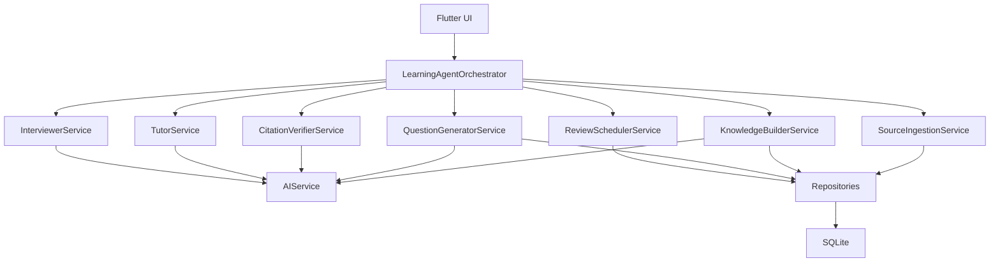

# Agent Architecture

## 设计结论

MVP 采用个人本地优先架构：

- Flutter + Riverpod + SQLite 继续作为主技术栈。
- LLM 继续使用 OpenAI-compatible API，但调用层升级为结构化任务。
- 不做一个万能 Agent，而是由 `LearningAgentOrchestrator` 调度多个专职模块。
- 数据主线从“题包 -> 题目”升级为“来源 -> 片段 -> 知识点 -> 题目”。
- 只有有来源且经过确认的内容默认进入正式学习路径。

## 总体架构



## 模块职责

### LearningAgentOrchestrator

统一调度 agent 任务，不直接处理数据库细节，也不直接拼 prompt。

职责：

- 根据用户选择的模式启动任务。
- 组合来源、知识点、题目和学习记录。
- 决定何时调用生成、核验、追问、评分和复习调度。
- 返回 UI 需要的结构化状态。

### SourceIngestionService

负责导入来源。

MVP 支持：

- 粘贴文本 / Markdown。
- 项目导入向导。
- 手动填写来源 URL、文件路径、行号范围。

暂不支持：

- 自动 GitHub 克隆。
- PDF 自动解析。
- 网页爬取。
- 视频解析。

### KnowledgeBuilderService

负责把来源片段拆成知识点。

输出：

- 知识点标题。
- 摘要。
- 标签。
- 难度。
- 面试相关性。
- 对应 source chunks。

### QuestionGeneratorService

负责从知识点生成题目。

输出题目必须包含：

- 题干。
- 类型。
- 选项。
- 答案。
- 解析。
- 知识点 ID。
- 引用的 source chunk IDs。
- source status 初始值。

### CitationVerifierService

负责来源预检。

预检内容：

- 引用片段是否存在。
- 答案是否能从引用片段推出。
- 是否存在明显无来源扩展。

输出状态：

- `verified_candidate`
- `weak_evidence`
- `no_source`

用户在核验预览页确认后，才能进入正式 `verified` 状态。

### InterviewerService

负责面试官模式。

流程：

1. 根据项目或学习单元生成面试问题。
2. 一次只问一个问题。
3. 用户先回答。
4. AI 评价回答。
5. 给出参考答案和来源依据。
6. 标记薄弱知识点。

评分维度：

- 准确性。
- 项目细节。
- 工程思维。
- 表达清晰度。

### TutorService

负责导师模式。

职责：

- 分层解释概念。
- 追问用户卡住的位置。
- 给例子和反例。
- 引导用户自己总结。
- 所有事实性解释必须引用来源。

### ReviewSchedulerService

负责复习调度和掌握度更新。

第一版采用可解释规则：

```text
knowledge_point_mastery =
  40% 最近题目正确率
+ 40% 面试回答评分
+ 20% 最近复习稳定性
```

复习规则：

- 答错 / 面试低分：当天或次日复习。
- 勉强掌握：2-3 天后复习。
- 稳定掌握：7 天后复习。
- 多次稳定：14 天后复习。

## 数据模型

### sources

```text
id
title
type: text | markdown | url | project | code_file | official_doc | user_note
uri
trust_level: official_doc | source_code | book_course | article | user_note | unknown
created_at
updated_at
```

### source_chunks

```text
id
source_id
chunk_index
content
locator
content_hash
created_at
```

`locator` 示例：

```text
https://example.com/docs#section-a
page 12
lib/services/content_analyzer.dart:19-105
README.md
```

### knowledge_points

```text
id
title
summary
tags
difficulty
interview_relevance
mastery_level
created_at
updated_at
```

### knowledge_point_sources

```text
knowledge_point_id
source_chunk_id
relation: defines | explains | example | counterexample | implementation
```

### questions

在现有 `questions` 表基础上新增：

```text
knowledge_point_id
difficulty
source_status: verified | pending | no_source
citation_ids
last_reviewed_at
next_review_at
ease
lapse_count
```

### learning_sessions

```text
id
mode: quiz | interview | tutor | project_walkthrough
target_id
started_at
ended_at
xp_gained
summary
```

### interview_turns

```text
id
session_id
question_text
user_answer
ai_feedback
reference_answer
citation_ids
accuracy_score
project_detail_score
engineering_score
clarity_score
weak_knowledge_point_ids
created_at
```

### answer_attempts

```text
id
session_id
question_id
knowledge_point_id
user_answer
is_correct
score
ai_feedback
created_at
```

## 来源状态策略

### verified

有来源片段，并且用户确认通过。

允许进入：

- 正式学习路径。
- 今日复习。
- 面试官模式。
- mastery 计算。

### pending

有来源，但用户未确认。

允许进入：

- 核验预览。
- 手动编辑。
- 草稿学习。

不默认进入正式学习路径。

### no_source

没有来源。

只允许作为草稿或临时笔记，不进入正式学习路径。

## 页面结构

底部导航：

```text
学习
知识库
Agent
我的
```

### 学习

- 今日任务。
- 学习路径。
- 随机挑战。
- 普通 quiz。

### 知识库

- 来源列表。
- 知识点列表。
- 待核验内容。
- 题目和引用。

### Agent

- 面试官模式。
- 导师模式。
- 复习模式。

MVP 优先实现面试官模式。

### 我的

- XP。
- streak。
- hearts。
- mastery。
- 学习报告。
- 薄弱知识点。

## AI 任务层

现有 `OpenAIService` 只保留为底层请求服务。

新增任务类：

```text
KnowledgeExtractionTask
QuestionGenerationTask
CitationVerificationTask
InterviewQuestionTask
AnswerEvaluationTask
TutorExplanationTask
```

每个任务必须：

- 明确输入模型。
- 明确输出 JSON schema。
- 解析失败时返回错误，不静默丢弃。
- 记录模型、时间、任务类型。

## MVP 边界

MVP 做：

- 个人本地知识库。
- 项目导入向导。
- 来源、片段、知识点、题目的结构化存储。
- 核验预览页。
- 面试官模式。
- 简单 mastery 和复习调度。

MVP 不做：

- 多用户账号。
- 云同步。
- 自动 GitHub 克隆。
- PDF/视频解析。
- 完整向量数据库。
- 复杂 FSRS 算法。

