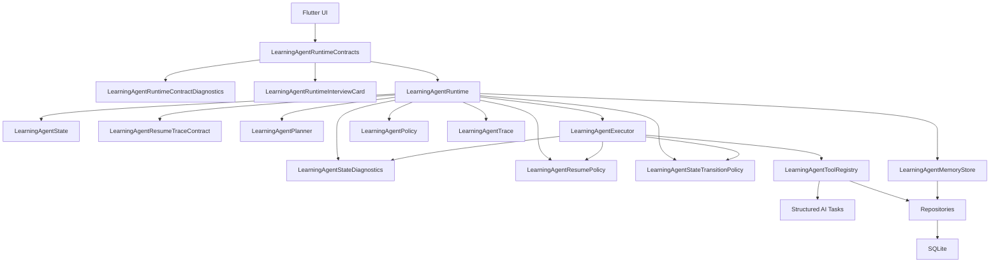

# Agent Runtime Architecture

调研日期：2026-07-09

## 结论

Anchor Learning 可以做成自己的知识库学习 agent，但第一版不建议直接引入 Python 后端或重型 agent 框架。更稳的路线是：

```text
Flutter-native lightweight agent runtime
+ LangGraph-style state graph
+ OpenAI Agents SDK-style tool loop, handoffs, guardrails, sessions, tracing
+ Parlant-style behavior policy
+ AgentScope-style events, permissions, trace
```

原因：

- 当前项目已经是 Flutter + Riverpod + SQLite，本地优先和来源可追溯是核心优势。
- 学习 agent 的关键不是“让模型自由行动”，而是让它在来源、核验、复习、面试反馈这些边界内可靠行动。
- 先做 Dart 原生 runtime，后面如需网页解析、GitHub 深度导入、向量检索、多人服务，再把同一套 runtime contract 迁移到后端。

## 当前架构判断

现在的 `Agent` 更准确地说是“确定性学习流程编排器”，不是完整 agent runtime：

- `LearningAgentPlannerService` 根据知识点、题目、历史追问生成学习路线。
- Riverpod providers 汇总数据并调用 planner。
- `AgentSessionLaunchScreen` 根据 `LearningAgentStepType` 直接跳转到导入、核验、导师、面试、练习、复习页面。
- `AgentSessionMemoryIndex` 从学习记录里解析追问和记忆。

这套实现是正确的 MVP 起点，因为它可控、可解释。但它缺少正常 agent framework 常见的几层：

- 显式状态机：每一步状态、输入、输出、暂停、恢复应该是数据，而不是散落在 UI switch 里。
- 工具注册表：导入来源、检索证据、生成问题、核验引用、启动面试等应被声明成 tool。
- 策略层：所有“无来源不得进入正式学习”“证据不足就请求补充材料”等规则应集中表达。
- 执行轨迹：agent 每次为什么选择某一步、用了哪些证据、是否被策略拦截，应可回放。
- 持久会话：Agent Session 不只是复盘文本，而应该能恢复到下一步状态。

## 框架调研取舍

| 框架 | 适合借鉴 | 对 Anchor Learning 的决定 |
| --- | --- | --- |
| LangGraph | 状态图、持久执行、human-in-the-loop、memory、trace | 作为核心架构蓝图，不直接引入依赖 |
| OpenAI Agents SDK | agent loop、function tools、handoffs、guardrails、sessions、tracing | 借鉴 runtime 术语和工具循环；以后有后端时可考虑 |
| Parlant | guideline、journey、行为边界、可靠遵循规则 | 借鉴为 `LearningAgentPolicy`，约束来源、引用、拒答和补材料 |
| AgentScope | event system、permission system、workspace/sandbox、多 session、RAG、middleware | 借鉴事件、权限和 trace；复杂工具执行阶段再考虑 |
| LangChain | model/tool/middleware 生态；其 agents 已建立在 LangGraph 上 | 用作参考和快速原型，不作为本 Flutter app 的核心 |
| CrewAI | role + task + crew + flow 的协作表达 | 可借鉴“面试官/导师/核验员”角色，但不作为主 runtime |
| AutoGen | 多 agent 对话历史价值 | 官方仓库显示维护模式，新项目不作为主选型 |
| Swarm | handoff 思想清晰，适合学习 | 官方已建议生产场景迁移到 OpenAI Agents SDK |
| Microsoft Agent Framework | AutoGen 后继、企业级多 agent 和 workflow | 若以后引入 Python/.NET 后端，再纳入候选 |
| Genkit Dart | Dart/Flutter 可用的 AI flows、工具、观测、本地开发 UI | 可作为未来 Dart AI flow 层候选；当前先保持轻量 |
| LangChain.dart | Dart/Flutter LLM 组件和 RAG/agent 原语 | 可作为局部工具库候选，不先绑定核心架构 |

## 推荐架构



### LearningAgentState

把一次 agent 运行变成可保存、可恢复、可解释的数据。

建议字段：

```text
session_id
goal
phase: plan | retrieve | act | verify | reflect | complete | canceled | blocked
target_id
focus_point_id
available_tools
selected_tool
active_tool_operation_id: stable logical operation identity or null
active_tool_input_snapshot: versioned routing-input JSON or null
evidence_chunk_ids
pending_user_decision: versioned UserDecisionRequest JSON or null
policy_warnings
trace_event_ids
created_at
updated_at
```

### LearningAgentStateTransitionPolicy

状态转换规则应该是纯函数，而不是散落在 executor 或 UI 判断里。

第一批规则：

- policy check 通过后进入 `verify`。
- policy check 阻断后进入 `blocked`。
- 工具启动后进入 `act`。
- 工具取消后保持 `act`。
- 用户决定继续时保持原 phase，决定结束时进入 `canceled`。
- 工具失败后进入 `blocked`。
- 工具完成且需要复盘面板时进入 `reflect`。
- 工具完成且不需要复盘面板时进入 `complete`。

### LearningAgentStateDiagnostics

runtime state 诊断应该使用统一格式，方便用户解释 agent 为什么停在某个阶段，也方便后续 session resume 调试。

第一批诊断行：

- 当前 phase。
- 当前 tool。
- 可用工具数量。
- 证据片段数量。
- policy warning 数量和代码。
- trace event 数量。
- target/focus id。
- 待用户决策。

### LearningAgentResumePolicy

恢复可行性先保持为纯策略，再由 v9 checkpoint 和 Agent 首页入口调用。

第一批 readiness：

- `ready`：有 state、有 tool，且恢复所需证据满足。
- `waiting_for_user`：可以恢复，但必须先让用户完成 pending decision。
- `missing_state`：没有 runtime state。
- `missing_plan`：旧 checkpoint 没有版本化 plan snapshot，不能猜测恢复。
- `incompatible_plan`：plan、tool、target 或 focus point 与 state 不一致。
- `missing_tool`：state 没有可继续执行的工具。
- `missing_evidence`：恢复目标工具需要证据，但 state 没有证据片段。
- `completed`：会话已经完成，不需要恢复。
- `blocked`：会话被策略或运行错误阻断，需要先处理阻断原因。

### LearningAgentResumeTraceContract

恢复 trace 契约先于恢复入口建立；当前入口沿用该契约，保证恢复行为可解释、可追踪。

第一版 `session_resumed` trace 需要记录：

- 恢复状态。
- 恢复原因。
- 原 phase。
- 恢复工具。
- 原 trace 数量。
- 最近 trace id。
- 证据片段数量。
- policy warning codes。

`LearningAgentRuntime.draftResumeTrace` 仍只生成草稿；`resumeCheckpoint` 在 policy 和 plan 兼容性检查通过后，才追加事件并持久化 checkpoint。

### LearningAgentRuntimeContracts

feature 层应该通过一个 runtime contract barrel 读取 Agent runtime 能力，而不是直接依赖多个内部 contract 文件。

第一版 barrel 导出：

- planner contract。
- runtime/session contract。
- executor interface 和 execution result。
- runtime providers。
- state/diagnostics/transition policy。
- trace/trace recorder。
- tool registry。
- resume policy 和 resume trace contract。

服务层内部仍使用直接 import，避免 barrel 变成内部依赖的“万能入口”。

### LearningAgentRuntimeContractDiagnostics

runtime contract checklist 用于把一次 Agent Session 的架构契约转成可复制诊断，也方便用户面试时解释“这个 agent runtime 由哪些部分组成”。

第一版 checklist 覆盖：

- state model。
- learning goal。
- selected tool。
- source/evidence requirement。
- evidence context。
- trace count。
- resume readiness。
- provider boundary。
- feature import boundary。

### LearningAgentRuntimeInterviewCard

面试讲解卡把 runtime contract 转成 app 内学习材料，让用户能直接练习“这个 agent 架构怎么讲”。

第一版卡片说明：

- Flutter 本地 runtime。
- planner 决定下一步。
- policy 检查来源约束。
- executor 调用本地工具。
- state 和 trace 记录决策。
- 本轮工具、阶段、trace 和证据上下文。
- 面试自测追问，用来练习解释框架取舍、来源约束、工具边界、恢复方案和未来迁移边界。
- 每条自测追问带一个简短答题提纲、参考答法、自评标准和证据提示，帮助用户把 runtime 设计讲成可追溯的面试表达。
- 面试讲法卡可以复制成完整学习笔记，便于用户在 app 外继续整理面试稿。
- 框架映射把 LangGraph、OpenAI Agents SDK、Parlant、AgentScope 的借鉴点对应到本地 Dart runtime 组件。
- 当前边界说明用于区分已实现 runtime contract 和未来能力，避免面试时夸大为完全自治或已接 RAG 的 agent。
- 代码依据锚点把每条 runtime 架构说法对应到本地文件，帮助用户从 app 讲回真实项目实现。
- 60 秒讲法把当前 goal、tool、phase、trace 和证据上下文串成一段可直接练习的回答。
- 回答检查 rubric 用达标信号和失分点帮助用户自查 runtime 面试回答是否完整。
- 60 秒讲法可单独复制，和完整面试材料复制分开，方便快速外部复习。
- 外部来源引用把框架借鉴对应到官方文档或项目主页，确保学习材料有正规依据。
- 外部来源带来源类型和可信度说明，区分官方文档、官方 SDK 文档、项目文档和项目仓库。
- 外部来源带核验日期和证据说明，说明它来自 2026-07-09 的 Smart Search 调研记录。
- 面试讲法卡用折叠 section 展示 rubric、框架映射、边界、代码依据、外部来源和自测追问，降低默认信息密度但保留完整材料。
- 面试讲法卡把完整讲法、Q&A 包和盲练稿复制动作收进菜单，避免标题行在窄屏变拥挤。
- 面试讲法卡提供调试练习复制包，把 runtime 故障场景转成“判断、排查、修复、复述”的主动回忆材料。
- 面试讲法卡提供演示脚本，把 Agent 目标入口、来源约束、工具执行、代码走读和 trace 复盘串成现场展示路线。
- 面试讲法卡提供来源核验清单，把 AI 草稿、已核验题目、source chunks、citation IDs 和外部框架来源转成可检查的正确性标准。
- 面试讲法卡提供回答框架，把项目总览、框架取舍、来源正确性、调试和未来演进问题转成稳定回答结构。
- 面试讲法卡提供追问应对，把“这是不是只是页面流程”“为什么不用重框架”“AI 如何避免胡说”等质疑转成短答、证据、边界和主线。
- 面试讲法卡提供追问练习复制包，把面试官质疑转成“短答、证据、边界、拉回主线、复述”的主动回忆材料。
- 面试讲法卡提供项目经历故事，把重建目标、runtime 抽象、来源正确性和 trace/debug 讲成背景、行动、取舍、证据和结果。
- 面试讲法卡提供项目经历练习复制包，把项目故事转成“提示、回答、背景、行动、取舍、证据、结果、复述”的主动回忆材料。
- 面试讲法卡提供模拟面试轮次，把项目总览、Agent 架构、来源正确性、代码走读和未来演进组织成带追问和通过信号的练习路线。
- 面试讲法卡提供模拟面试练习复制包，把面试轮次转成“主回答、压力追问、证据核对、修正复述”的 grill-me 风格练习材料。
- 面试讲法卡提供模拟面试评分规则，把结构、证据、边界、调试路径和表达压缩转成满分信号、失分信号和修复动作。
- 面试讲法卡提供模拟面试评分复盘表，把练后分数、失分原因、修复记录和下次复测结果组织成可复制模板。
- 面试讲法卡提供模拟面试修复路线，把常见失分症状映射到回看材料、练习动作、复测问题和完成信号。
- 面试讲法卡提供模拟面试修复练习复制包，把失分症状转成原失败回答、重练回答、复测回答和完成确认。
- 面试讲法卡提供术语速记，把 Planner、Policy gate、Tool registry、Executor、Trace、Runtime state 等词转成定义和面试用法。
- 面试讲法卡提供框架选型矩阵，把 LangGraph、OpenAI Agents SDK、Parlant、AgentScope 的适合场景、暂不采用原因和未来接入路径讲清楚。
- 面试讲法卡提供架构决策记录，把 Flutter 本地 runtime、确定性 planner、source-grounded learning 和 trace-first 的原因、代价、面试讲法写清楚。
- 面试讲法卡提供避坑清单，把容易夸大的 risky claim 转成 safer claim，帮助用户在面试中诚实地区分架构借鉴、当前实现和未来迁移。
- 面试讲法卡提供成熟度阶梯，把当前 runtime 定位到受控学习编排器，并说明来源约束 agent、可恢复状态图和可评估 agent 系统的能力缺口。
- 面试讲法卡提供演进路线，把当前本地 runtime 如何升级到状态图、工具循环、RAG 检索和 trace replay 讲成可执行的后续架构路径。
- 面试讲法卡提供迁移触发条件，把长任务恢复、工具失败路径、语义召回和决策质量评估何时需要升级到重 agent 框架说清楚。
- 面试讲法卡提供代码走读路线，把 Agent Session 准备页、planner、tool registry、policy、executor、state 和 trace 串成可按文件讲解的路线。
- 面试讲法卡提供调试场景，把 planner 选错工具、policy 误拦截、executor 失败、state/trace 不一致和 evidence ID 缺失转成可排查路径。
- 面试讲法卡支持复制 Q&A 练习包，把自测追问、提纲、回答检查、代码依据和外部来源组合成可模拟面试的材料。
- 面试讲法卡支持复制盲练稿，只保留问题、提纲、自评标准、证据提示和作答空位，用于主动回忆。
- 面试讲法卡提供练习流程，把先自答、对照参考、核对证据和压缩复述串成可执行步骤。
- 自测追问增加证据提示，把每道问题关联到代码文件、架构文档或外部框架来源。
- 面试讲法卡显示证据覆盖摘要，统计代码依据、外部来源和带证据提示的自测题数量。
- 自测追问增加参考答法，让用户可以先自答，再对照一段不夸大当前能力的面试口径。
- 自测追问增加自评标准，让用户能检查自己的回答是否覆盖核心架构点、来源约束和诚实边界。

### LearningAgentPlanner

继续保留当前 planner 的优势，但输出从“UI 路线”升级为“runtime step”。

它应该只决定：

- 下一步应该做什么。
- 为什么选择这一步。
- 需要哪些输入和证据。
- 如果不能继续，缺口是什么。

### LearningAgentToolRegistry

把 app 内已有能力声明成工具，而不是让 UI 直接分发。

第一批工具：

- `import_sources`
- `verify_pending_questions`
- `search_knowledge_base`
- `open_tutor_session`
- `open_interview_session`
- `start_verified_practice`
- `start_review_session`
- `save_agent_reflection`

每个工具都需要：

- typed input
- typed result
- required permissions
- evidence requirements
- failure diagnostics
- trace summary

### LearningAgentPolicy

这是 Anchor Learning 比通用 agent 更重要的一层。规则应集中、可测试、可解释。

第一批 policy：

- 正式学习只能使用 `source_status = verified` 的题目。
- 导师和面试必须绑定真实 source chunks。
- AI 生成内容不是来源，只能作为草稿或解释。
- 检索不到证据时，agent 必须要求导入或补充来源。
- 引用 ID 不存在、来源缺失、知识点无证据时，工具调用应被拦截或降级。
- 面试参考答案如果超出证据，应标记为“需要补来源”，不能进入正式记忆。

### LearningAgentExecutor

Executor 负责执行工具、处理暂停/恢复、更新状态和写 trace。

第一版可以仍然通过 `Navigator` 打开页面，但调用入口应该从 UI switch 移到 executor。这样之后可以平滑变成：

```text
agent decides step
-> executor validates policy
-> executor invokes tool
-> tool returns result
-> runtime records trace
-> planner computes next state
```

### LearningAgentTrace

trace 用于学习复盘和面试解释，也用于调试。
trace 的文本导出格式由 `LearningAgentTrace` 集中维护，Agent Session summary、失败诊断和历史记忆解析共享同一套 `Agent Trace:` / `Trace:` 规范。
运行中事件先通过 `LearningAgentTraceRecorder` 记录，recorder 负责保持事件列表和 `LearningAgentState.traceEventIds` 同步；后续如果独立建 trace 表或 trace sink，可以接在 recorder 后面。

事件类型：

- `plan_created`
- `policy_checked`
- `tool_selected`
- `tool_started`
- `tool_completed`
- `tool_failed`
- `evidence_attached`
- `user_interrupted`
- `session_resumed`
- `reflection_saved`

### LearningAgentMemoryStore

现有 `AgentSessionMemoryIndex` 可以升级成 memory store。

短期记忆：

- 当前 session 的目标、证据、追问、执行结果。

长期记忆：

- 同一学习目标下的历史复盘。
- 未处理追问。
- 薄弱知识点。
- 高频失败原因。

## 知识库学习 Agent 形态

可以，而且应该做成“自己的知识库学习 agent”。建议定义为：

```text
用户来源材料
-> source chunks
-> knowledge points
-> verified questions
-> agent sessions
-> memory and review schedule
```

它不是简单聊天机器人，而是一个能执行学习闭环的 agent：

- 能回答知识库问题，但回答必须带引用。
- 能根据项目材料追问面试题。
- 能让用户先回答，再评分、给参考答案和来源。
- 能把薄弱点转成复习队列。
- 能把“我还不会什么”保存成下一轮 follow-up。

## 为什么暂不直接引入框架

短期直接引入 LangGraph/OpenAI Agents SDK/AgentScope 会带来三个问题：

- 多半需要 Python 后端，和当前 Flutter 本地优先架构不匹配。
- app 的核心学习动作已经在 Dart/SQLite/UI 内部，跨进程调用会让 MVP 变重。
- 用户面试时更需要讲清楚“我如何设计 agent runtime”，而不是“我套了一个框架”。

所以第一阶段要做的是框架化自己的 runtime contract；等功能复杂到需要后端时，再迁移执行层。

## Trellis 推进

### Branch 13：Agent Runtime Foundation

目标：把当前确定性学习流程升级成轻量 agent runtime，但不改变用户可见行为。

#### Leaf 13.1：记录框架调研和 runtime 决策

输出：

- 新增本文档。
- 明确当前 agent 的架构缺口。
- 明确推荐 runtime 组件和框架借鉴边界。

#### Leaf 13.2：新增 LearningAgentState 模型

输出：

- 新增 state/phase/target/evidence/policy warning 数据结构。
- 不接 UI，不改变行为。

#### Leaf 13.3：新增 LearningAgentPolicy

输出：

- 把来源约束、引用约束、正式学习约束集中成 policy。
- 先只做纯函数检查。

#### Leaf 13.4：新增 LearningAgentTraceEvent

输出：

- 建立 trace event model。
- 暂不落库，先在 runtime 内返回。

#### Leaf 13.5：新增 ToolRegistry skeleton

输出：

- 把现有学习动作声明成 tool metadata。
- 不移动页面逻辑。

#### Leaf 13.6：引入 LearningAgentExecutor

输出：

- 把 `AgentSessionLaunchScreen` 中启动学习动作的 switch 迁出到 executor。
- UI 行为保持不变。

#### Leaf 13.7：执行前 policy gate

输出：

- executor 在启动工具前调用 policy。
- 拦截无证据/无核验/缺失来源的非法路径。

#### Leaf 13.8：记录本地 trace

输出：

- 每次 agent session 启动、完成、失败都有 trace。
- 先保存在 session summary 或内存结构中，后续再迁移到表。

#### Leaf 13.9：新增 LearningAgentMemoryStore facade

输出：

- 把 `AgentSessionMemoryIndex` 包装成 runtime-facing 记忆接口。
- 为 planner 提供 goal memory snapshot。
- 为后续 session resume、长期记忆和目标级追问恢复保留统一入口。

#### Leaf 13.10：新增 LearningAgentRuntime facade

输出：

- 准备 Agent Session 的 session id、初始 state、可用工具和 plan_created trace。
- 让 Agent Session 启动通过 runtime session 创建 executor context。
- 保持当前 Flutter 本地导航执行方式不变。

#### Leaf 13.11：Executor 复用 LearningAgentMemoryStore

输出：

- executor 加载目标级历史追问时走 `LearningAgentMemoryStore`。
- 追问完成检测仍保留现有 matcher，后续再独立抽成 runtime completion policy。

#### Leaf 13.12：Executor provider 边界

输出：

- 通过 `learningAgentExecutorProvider` 暴露 `LearningAgentExecutor`。
- UI 只依赖 executor 抽象接口，不直接构造默认实现。

#### Leaf 13.13：Agent runtime provider 依赖边界

输出：

- 将 runtime/executor provider 放入 agent 专属 provider 文件。
- 避免核心 provider 文件与 executor 互相 import。

#### Leaf 13.14：完成复盘展示 Agent Trace

输出：

- Agent Session 完成返回后，在复盘保存前展示本轮 trace。
- 用户可以在写复盘前确认 agent 的计划、策略检查、工具执行结果。

#### Leaf 13.15：集中 Agent Trace 文本格式

输出：

- 将 `Agent Trace:` header、`Trace:` 行格式、时间格式和单行摘要清洗集中到 `LearningAgentTrace`。
- summary 保存、executor 失败诊断和 Agent Session 记忆解析共享同一文本格式。

#### Leaf 13.16：新增 Agent Trace Recorder

输出：

- 新增 `LearningAgentTraceRecorder`，集中维护当前 session 的 trace event 列表。
- recorder 记录事件时同步更新 runtime state 的 phase、evidence context 和 `traceEventIds`。
- executor 通过 recorder 记录事件，并在执行结果中返回更新后的 runtime state。
- Agent Session 准备页保留最新 runtime state，用于诊断当前 agent 阶段。

#### Leaf 13.17：集中 Agent state transition policy

输出：

- 新增 `LearningAgentStateTransitionPolicy`，集中表达 runtime phase 转换规则。
- executor 通过该 policy 决定 policy check、tool start、tool result、tool failure 后的 phase。
- 完成路径区分 `reflect` 和 `complete`，为后续 resume 与持久状态表打基础。

#### Leaf 13.18：集中 Agent runtime state diagnostics

输出：

- 新增 `learningAgentStateDiagnosticLines`，统一格式化 runtime state 快照。
- executor 和 Agent Session 准备页复用同一套 state diagnostics。
- 失败诊断避免重复输出 state diagnostic lines。

#### Leaf 13.19：Agent Session resume readiness

输出：

- 新增 `LearningAgentResumePolicy`，定义 runtime state 是否可恢复以及原因。
- executor 和 Agent Session 准备页诊断加入 resume readiness。
- 暂不启用真正恢复入口，也不改变 learning session schema。

#### Leaf 13.20：Agent resume trace event contract

输出：

- 新增 `LearningAgentResumeTraceContract`，定义 `session_resumed` trace 的生成规则。
- `LearningAgentRuntime` 暴露 `draftResumeTrace`，只生成恢复 trace 草稿。
- trace 草稿保留原 trace ids 和恢复原因，不真正记录恢复事件。

#### Leaf 13.21：Agent runtime contract barrel

输出：

- 新增 `learning_agent_runtime_contracts.dart`，作为 feature 层 runtime contract 入口。
- Agent Session launch/home/detail/history 页面通过 barrel 导入 runtime contract。
- barrel 不导出默认 executor concrete class，feature 层仍依赖 executor interface/provider。

#### Leaf 13.22：Agent runtime contract diagnostics coverage

输出：

- 新增 `learningAgentRuntimeContractChecklistLines`，输出可复制的 runtime contract checklist。
- executor 和 Agent Session 准备页诊断加入 contract checklist。
- checklist 覆盖 state、tool、source/evidence、trace、resume、provider 和 feature import boundary。

#### Leaf 13.23：Agent runtime interview explanation card

输出：

- 新增 `learningAgentRuntimeInterviewCard`，从 plan/state/trace 生成面试讲解内容。
- Agent Session 准备页展示“面试讲法：本地学习 Agent”。
- 卡片把 planner、policy、executor、state、trace 和来源约束转成可练习说法。

#### Leaf 13.24：Agent runtime interview prompts

输出：

- `LearningAgentRuntimeInterviewCard` 增加 runtime 架构自测追问。
- Agent Session 准备页在讲解卡中展示自测追问。
- 追问覆盖框架取舍、来源约束、executor/tool/provider 边界、session 恢复和未来迁移。

#### Leaf 13.25：Agent runtime answer outline

输出：

- 新增 `LearningAgentInterviewPrompt`，把自测追问升级为 question + outline。
- `learningAgentRuntimeInterviewCard` 为每条追问生成简短答题提纲。
- Agent Session 准备页在追问下展示“提纲”，让用户能直接练习 agent runtime 架构回答。
- 提纲围绕本地 runtime 取舍、来源约束、防幻觉、executor/tool/provider 边界、恢复方案和未来迁移边界。

#### Leaf 13.26：Copyable Agent runtime interview notes

输出：

- 新增 `learningAgentRuntimeInterviewCardCopyText`，把 runtime 面试讲法卡格式化为可复制学习笔记。
- 复制文本包含讲法、自测追问、答题提纲和依据。
- Agent Session 准备页提供复制按钮，用户可以把当前计划对应的 agent runtime 讲法带到外部面试准备材料中。
- 不改变 Agent Session 执行、复盘保存、trace 保存或 learning session schema。

#### Leaf 13.27：Agent runtime framework mapping

输出：

- 新增 `LearningAgentFrameworkMapping`，把外部 agent 框架思想映射到本地 runtime 组件。
- `LearningAgentRuntimeInterviewCard` 展示 LangGraph、OpenAI Agents SDK、Parlant、AgentScope 四类借鉴。
- 复制版面试讲法包含框架映射，帮助用户回答“没有直接用框架，为什么仍是正常 agent 架构”。
- 不改变 Agent Session 执行、复盘保存、trace 保存或 learning session schema。

#### Leaf 13.28：Agent runtime boundary notes

输出：

- 新增 `LearningAgentRuntimeBoundaryNote`，把当前 runtime 边界转成面试安全讲法。
- `LearningAgentRuntimeInterviewCard` 展示自治程度、恢复能力、知识检索、框架依赖四类边界。
- 复制版面试讲法包含当前事实和安全讲法，帮助用户诚实解释“现在做到哪里，下一步怎么扩展”。
- 不改变 Agent Session 执行、复盘保存、trace 保存或 learning session schema。

#### Leaf 13.29：Agent runtime code evidence anchors

输出：

- 新增 `LearningAgentRuntimeEvidenceAnchor`，把 runtime 架构 claim 对应到本地代码文件。
- `LearningAgentRuntimeInterviewCard` 展示 state、executor、policy、trace 四类代码依据。
- 复制版面试讲法包含代码路径和支撑理由，方便用户准备项目细节追问。
- 不改变 Agent Session 执行、复盘保存、trace 保存或 learning session schema。

#### Leaf 13.30：Agent runtime 60-second answer script

输出：

- `LearningAgentRuntimeInterviewCard` 新增 `answerScript`，生成当前 Agent Session 对应的 60 秒面试讲法。
- 脚本串联本地学习 runtime、planner、policy、executor、state、trace 和未来迁移边界。
- Agent Session 准备页展示“60 秒讲法”，复制版面试材料同步包含该脚本。
- 不改变 Agent Session 执行、复盘保存、trace 保存或 learning session schema。

#### Leaf 13.31：Agent runtime answer rubric

输出：

- 新增 `LearningAgentRuntimeAnswerRubricItem`，为 60 秒 runtime 回答生成自查 rubric。
- rubric 覆盖本地优先、来源约束、runtime contract 和诚实边界。
- Agent Session 准备页展示“回答检查”，复制版面试材料同步包含达标信号和容易失分点。
- 不改变 Agent Session 执行、复盘保存、trace 保存或 learning session schema。

#### Leaf 13.32：Copy 60-second runtime answer

输出：

- 新增 `learningAgentRuntimeAnswerScriptCopyText`，单独格式化 60 秒讲法、回答检查和依据提示。
- Agent Session 准备页在“60 秒讲法”标题旁提供单独复制按钮。
- 完整面试讲法复制仍保留，用户可按复习场景选择短回答或完整材料。
- 不改变 Agent Session 执行、复盘保存、trace 保存或 learning session schema。

#### Leaf 13.33：Agent runtime external source references

输出：

- 新增 `LearningAgentRuntimeSourceReference`，为框架借鉴提供来源标题、URL 和支撑说明。
- `LearningAgentRuntimeInterviewCard` 展示 LangGraph、OpenAI Agents SDK、Parlant、AgentScope 四类外部来源。
- 完整复制材料包含独立“外部来源”区块，60 秒讲法复制文本也保留来源依据。
- 不改变 Agent Session 执行、复盘保存、trace 保存或 learning session schema。

#### Leaf 13.34：Agent runtime source trust labels

输出：

- `LearningAgentRuntimeSourceReference` 增加来源类型和可信度说明。
- Agent Session 准备页在外部来源中展示官方文档、官方 SDK 文档、项目文档、项目仓库等类型。
- 完整复制材料保留独立外部来源区块，60 秒讲法复制文本在依据中包含外部来源。
- 不改变 Agent Session 执行、复盘保存、trace 保存或 learning session schema。

#### Leaf 13.35：Agent runtime source verification metadata

输出：

- `LearningAgentRuntimeSourceReference` 增加核验日期和证据说明。
- LangGraph、OpenAI Agents SDK、Parlant、AgentScope 外部来源都标注 2026-07-09 调研日期。
- 页面展示和复制文本都说明来源记录来自 `docs/agent-runtime-architecture.md` 与 Smart Search evidence 路径。
- 不改变 Agent Session 执行、复盘保存、trace 保存或 learning session schema。

#### Leaf 13.36：Agent runtime interview compact sections

输出：

- Agent Session 准备页的 runtime 面试卡片把回答检查、讲法要点、框架映射、当前边界、代码依据、外部来源、自测追问组织为折叠 section。
- 每个 section 标题显示数量和一行摘要，展开后展示完整学习材料。
- 60 秒讲法和复制入口继续默认可见，回答检查默认展开。
- 不改变 Agent Session 执行、复盘保存、trace 保存或 learning session schema。

#### Leaf 13.37：Agent runtime interview Q&A copy packet

输出：

- 新增纯 Dart `learningAgentRuntimeQuestionAnswerPackCopyText`。
- Q&A 练习包包含 60 秒总答、自测问答、回答检查、代码依据、外部来源和依据说明。
- Agent Session 准备页新增“复制面试 Q&A 包”按钮。
- 不改变 Agent Session 执行、复盘保存、trace 保存或 learning session schema。

#### Leaf 13.38：Agent runtime interview prompt evidence hints

输出：

- `LearningAgentInterviewPrompt` 增加证据提示。
- 5 条自测追问都标明作答时可引用的代码文件、架构文档或外部来源。
- 完整面试材料、Q&A 练习包和 Agent Session 准备页都展示证据提示。
- 不改变 Agent Session 执行、复盘保存、trace 保存或 learning session schema。

#### Leaf 13.39：Agent runtime interview evidence coverage summary

输出：

- 新增纯 Dart `learningAgentRuntimeEvidenceCoverageSummary`。
- 完整面试材料、60 秒讲法、Q&A 练习包和 Agent Session 准备页共享同一证据覆盖摘要。
- 摘要统计代码依据、外部来源和带证据提示的自测题数量。
- 不改变 Agent Session 执行、复盘保存、trace 保存或 learning session schema。

#### Leaf 13.40：Agent runtime interview prompt sample answers

输出：

- `LearningAgentInterviewPrompt` 增加参考答法。
- 5 条自测追问都提供可直接练习的参考回答。
- 完整面试材料、Q&A 练习包和 Agent Session 准备页都展示参考答法。
- 证据覆盖摘要统计带参考答法的自测题数量。
- 不改变 Agent Session 执行、复盘保存、trace 保存或 learning session schema。

#### Leaf 13.41：Agent runtime interview prompt self-check criteria

输出：

- `LearningAgentInterviewPrompt` 增加自评标准。
- 5 条自测追问都提供答后检查口径。
- 完整面试材料、Q&A 练习包和 Agent Session 准备页都展示自评标准。
- 证据覆盖摘要统计带自评标准的自测题数量。
- 不改变 Agent Session 执行、复盘保存、trace 保存或 learning session schema。

#### Leaf 13.42：Agent runtime interview practice flow

输出：

- `LearningAgentRuntimeInterviewCard` 增加练习流程。
- 新增 `LearningAgentRuntimePracticeStep`，记录练习步骤、动作和达标信号。
- 练习流程包含先自答、对照参考、核对证据、压缩复述。
- 完整面试材料、Q&A 练习包和 Agent Session 准备页都展示练习流程。
- 不改变 Agent Session 执行、复盘保存、trace 保存或 learning session schema。

#### Leaf 13.43：Agent runtime interview blind drill copy

输出：

- 新增纯 Dart `learningAgentRuntimeBlindDrillCopyText`。
- 盲练稿包含证据覆盖、练习流程、盲练题、自评标准、证据提示和回答检查。
- 盲练稿保留“我的回答”和“修正后答案”空位，不直接输出参考答法。
- Agent Session 准备页新增“复制面试盲练稿”按钮。
- 不改变 Agent Session 执行、复盘保存、trace 保存或 learning session schema。

#### Leaf 13.44：Agent runtime interview copy action menu

输出：

- Agent Session 准备页把完整讲法、Q&A 包、盲练稿复制动作收敛到一个菜单。
- 菜单项复用统一的图标和文本样式。
- 60 秒讲法复制按钮继续保留在 60 秒讲法区域。
- 不改变复制 formatter、Agent Session 执行、复盘保存、trace 保存或 learning session schema。

#### Leaf 13.45：Agent runtime interview glossary terms

输出：

- `LearningAgentRuntimeInterviewCard` 增加术语速记。
- 新增 `LearningAgentRuntimeGlossaryTerm`，记录术语、定义和面试用法。
- 默认术语覆盖 Planner、Policy gate、Tool registry、Executor、Trace、Runtime state。
- 完整面试材料、Q&A 练习包和 Agent Session 准备页都展示术语速记。
- 不改变 Agent Session 执行、复盘保存、trace 保存或 learning session schema。

#### Leaf 13.46：Agent runtime interview pitfall guardrails

输出：

- `LearningAgentRuntimeInterviewCard` 增加避坑清单。
- 新增 `LearningAgentRuntimePitfall`，记录风险说法、更稳妥说法和原因。
- 默认避坑覆盖外部框架依赖、完全自治、完整 RAG/vector DB、AI 输出直接进入正式学习四类表达风险。
- 完整面试材料、Q&A 练习包、盲练稿和 Agent Session 准备页都展示避坑清单。
- 不改变 Agent Session 执行、复盘保存、trace 保存或 learning session schema。

#### Leaf 13.47：Agent runtime framework evolution roadmap

输出：

- `LearningAgentRuntimeInterviewCard` 增加演进路线。
- 新增 `LearningAgentRuntimeEvolutionStep`，记录里程碑、当前基础、下一步升级和面试讲法。
- 默认路线覆盖状态图标准化、工具循环增强、来源检索升级和可观测复盘。
- 完整面试材料、Q&A 练习包、盲练稿和 Agent Session 准备页都展示演进路线。
- 不改变 Agent Session 执行、复盘保存、trace 保存或 learning session schema。

#### Leaf 13.48：Agent runtime architecture decision records

输出：

- `LearningAgentRuntimeInterviewCard` 增加架构决策记录。
- 新增 `LearningAgentRuntimeDecisionRecord`，记录决策、原因、代价和面试讲法。
- 默认决策覆盖 Flutter/Dart 本地 runtime、确定性 planner + policy gate、source-grounded learning 优先、trace-first runtime。
- 完整面试材料、Q&A 练习包、盲练稿和 Agent Session 准备页都展示架构决策。
- 证据覆盖摘要展示架构决策数量。
- 不改变 Agent Session 执行、复盘保存、trace 保存或 learning session schema。

#### Leaf 13.49：Agent runtime framework migration triggers

输出：

- `LearningAgentRuntimeInterviewCard` 增加迁移触发条件。
- 新增 `LearningAgentRuntimeMigrationTrigger`，记录触发条件、当前信号、升级动作和面试讲法。
- 默认触发条件覆盖长任务恢复、工具失败路径增多、来源语义召回瓶颈、agent 决策质量评估。
- 完整面试材料、Q&A 练习包、盲练稿和 Agent Session 准备页都展示迁移触发条件。
- 证据覆盖摘要展示迁移触发条件数量。
- 不改变 Agent Session 执行、复盘保存、trace 保存或 learning session schema。

#### Leaf 13.50：Agent runtime maturity ladder

输出：

- `LearningAgentRuntimeInterviewCard` 增加成熟度阶梯。
- 新增 `LearningAgentRuntimeMaturityLevel`，记录层级、已实现信号、能力缺口、下一层里程碑和面试讲法。
- 默认阶梯覆盖受控学习编排器、来源约束学习 agent、可恢复状态图 runtime、可评估 agent 系统。
- 完整面试材料、Q&A 练习包、盲练稿和 Agent Session 准备页都展示成熟度阶梯。
- 证据覆盖摘要展示成熟度层级数量。
- 不改变 Agent Session 执行、复盘保存、trace 保存或 learning session schema。

#### Leaf 13.51：Agent runtime framework selection matrix

输出：

- `LearningAgentRuntimeInterviewCard` 增加框架选型矩阵。
- 新增 `LearningAgentRuntimeFrameworkSelection`，记录框架、适合场景、当前不直接采用的原因、未来接入路径和面试讲法。
- 默认矩阵覆盖 LangGraph、OpenAI Agents SDK、Parlant、AgentScope。
- 完整面试材料、Q&A 练习包、盲练稿和 Agent Session 准备页都展示框架选型。
- 证据覆盖摘要展示框架选型项数量。
- 不改变 Agent Session 执行、复盘保存、trace 保存或 learning session schema。

#### Leaf 13.52：Agent runtime code walkthrough route

输出：

- `LearningAgentRuntimeInterviewCard` 增加代码走读路线。
- 新增 `LearningAgentRuntimeCodeWalkthroughStep`，记录走读步骤、文件路径、看点和面试讲法。
- 默认路线覆盖 Agent Session 准备页、planner、tool registry、policy gate、executor、state + trace。
- 完整面试材料、Q&A 练习包、盲练稿和 Agent Session 准备页都展示代码走读路线。
- 证据覆盖摘要展示代码走读步数。
- 不改变 Agent Session 执行、复盘保存、trace 保存或 learning session schema。

#### Leaf 13.53：Agent runtime debugging scenarios

输出：

- `LearningAgentRuntimeInterviewCard` 增加调试场景。
- 新增 `LearningAgentRuntimeDebugScenario`，记录场景、可能原因、排查路径、修复策略和面试讲法。
- 默认场景覆盖 planner 选错工具、policy gate 误拦截、executor 启动或完成失败、state/trace 不一致、来源引用或 evidence IDs 不完整。
- 完整面试材料、Q&A 练习包、盲练稿和 Agent Session 准备页都展示调试场景。
- 证据覆盖摘要展示调试场景数量。
- 不改变 Agent Session 执行、复盘保存、trace 保存或 learning session schema。

#### Leaf 13.54：Agent runtime debugging drill copy packet

输出：

- 新增 `learningAgentRuntimeDebugDrillCopyText`，把调试场景生成专门的主动回忆练习材料。
- 调试练习包含故障现象、我的判断、可能原因、排查路径、修复策略、面试讲法和修正后复述。
- Agent Session 准备页复制菜单新增“复制调试练习”。
- 调试练习复用已有调试场景、代码走读路线、代码依据和来源说明。
- 不改变 Agent Session 执行、复盘保存、trace 保存或 learning session schema。

#### Leaf 13.55：Agent runtime interview demo script

输出：

- `LearningAgentRuntimeInterviewCard` 增加演示脚本。
- 新增 `LearningAgentRuntimeDemoStep`，记录演示时刻、app 操作、讲法和证据点。
- 默认演示脚本覆盖 Agent 目标入口、来源约束和证据覆盖、受控工具执行、代码走读/调试场景、trace 复盘。
- 完整面试材料、Q&A 练习包、盲练稿和 Agent Session 准备页都展示演示脚本。
- 证据覆盖摘要展示演示脚本步数。
- 不改变 Agent Session 执行、复盘保存、trace 保存或 learning session schema。

#### Leaf 13.56：Agent runtime source-grounding audit checklist

输出：

- `LearningAgentRuntimeInterviewCard` 增加来源核验清单。
- 新增 `LearningAgentRuntimeSourceGroundingCheck`，记录核验项、核验路径、通过信号、失败处理和面试讲法。
- 默认清单覆盖 AI 草稿不能直接进入正式学习、正式练习只用已核验题、导师/面试必须绑定来源片段、citation IDs 必须能读到真实片段、外部框架说法必须有官方来源。
- 完整面试材料、Q&A 练习包、盲练稿、调试练习和 Agent Session 准备页都展示来源核验清单。
- 证据覆盖摘要展示来源核验项数量。
- 不改变 Agent Session 执行、复盘保存、trace 保存或 learning session schema。

#### Leaf 13.57：Agent runtime interview answer frames

输出：

- `LearningAgentRuntimeInterviewCard` 增加回答框架。
- 新增 `LearningAgentRuntimeAnswerFrame`，记录问题类型、开场主张、要提到的证据、需要说明的边界和收束句。
- 默认回答框架覆盖项目总览、为什么不直接用重 agent 框架、如何保证来源正确、如何调试 agent 行为、未来演进。
- 完整面试材料、Q&A 练习包、盲练稿和 Agent Session 准备页都展示回答框架。
- 证据覆盖摘要展示回答框架数量。
- 不改变 Agent Session 执行、复盘保存、trace 保存或 learning session schema。

#### Leaf 13.58：Agent runtime interview challenge responses

输出：

- `LearningAgentRuntimeInterviewCard` 增加追问应对。
- 新增 `LearningAgentRuntimeChallengeResponse`，记录面试质疑、短答、可展示证据、诚实边界和拉回主线。
- 默认追问应对覆盖“这是不是只是页面流程”、为什么不用重 agent 框架、AI 如何避免胡说、是否真的理解 vibe coding 代码、如何扩展成知识库 agent。
- 完整面试材料、Q&A 练习包、盲练稿和 Agent Session 准备页都展示追问应对。
- 证据覆盖摘要展示追问应对数量。
- 不改变 Agent Session 执行、复盘保存、trace 保存或 learning session schema。

#### Leaf 13.59：Agent runtime challenge drill copy packet

输出：

- 新增 `learningAgentRuntimeChallengeDrillCopyText`，把追问应对生成专门的主动回忆练习材料。
- 追问练习包含质疑、我的短答、参考短答、证据、边界、拉回主线和修正后复述。
- Agent Session 准备页复制菜单新增“复制追问练习”。
- 追问练习复用已有追问应对、回答框架、代码依据、外部来源和来源说明。
- 不改变 Agent Session 执行、复盘保存、trace 保存或 learning session schema。

#### Leaf 13.60：Agent runtime experience stories

输出：

- `LearningAgentRuntimeInterviewCard` 增加项目经历故事。
- 新增 `LearningAgentRuntimeExperienceStory`，记录面试提示、背景、行动、技术取舍、证据和结果。
- 默认项目经历覆盖从刷题 app 到学习 agent、runtime 抽象、AI 输出质量控制、trace/debug 可解释性。
- 完整面试材料、Q&A 练习包、盲练稿和 Agent Session 准备页都展示项目经历。
- 证据覆盖摘要展示项目经历数量。
- 不改变 Agent Session 执行、复盘保存、trace 保存或 learning session schema。

#### Leaf 13.61：Agent runtime experience drill copy packet

输出：

- 新增 `learningAgentRuntimeExperienceDrillCopyText`，把项目经历故事生成专门的主动回忆练习材料。
- 项目经历练习包含经历提示、我的回答、背景、行动、技术取舍、证据、结果和修正后复述。
- Agent Session 准备页复制菜单新增“复制项目经历练习”。
- 项目经历练习复用已有项目经历、回答框架、代码依据、外部来源和来源说明。
- 不改变 Agent Session 执行、复盘保存、trace 保存或 learning session schema。

#### Leaf 13.62：Agent runtime mock interview rounds

输出：

- `LearningAgentRuntimeInterviewCard` 增加模拟面试轮次。
- 新增 `LearningAgentRuntimeMockInterviewRound`，记录轮次、面试官问题、压力追问、预期证据和通过信号。
- 默认轮次覆盖项目总览、Agent 架构、来源正确性、代码走读和未来演进。
- 完整面试材料、Q&A 练习包、盲练稿和 Agent Session 准备页都展示模拟面试轮次。
- 证据覆盖摘要展示模拟面试轮次数量。
- 不改变 Agent Session 执行、复盘保存、trace 保存或 learning session schema。

#### Leaf 13.63：Agent runtime mock interview drill copy packet

输出：

- 新增 `learningAgentRuntimeMockInterviewDrillCopyText`，把模拟面试轮次生成专门的主动回忆练习材料。
- 模拟面试练习包含主问题、我的主回答、压力追问、我的追问短答、预期证据、通过信号、证据核对和修正后复述。
- Agent Session 准备页复制菜单新增“复制模拟面试练习”。
- 模拟面试练习复用已有模拟面试轮次、回答框架、追问应对、项目经历、代码依据、外部来源和来源说明。
- 不改变 Agent Session 执行、复盘保存、trace 保存或 learning session schema。

#### Leaf 13.64：Agent runtime mock interview score rules

输出：

- `LearningAgentRuntimeInterviewCard` 增加模拟面试评分规则。
- 新增 `LearningAgentRuntimeMockInterviewScoreRule`，记录评分项、满分信号、失分信号和修复动作。
- 默认评分规则覆盖结构完整、证据可展示、边界诚实、调试路径清楚和表达可压缩。
- 完整面试材料、Q&A 练习包、盲练稿、模拟面试练习和 Agent Session 准备页都展示评分规则。
- 证据覆盖摘要展示模拟面试评分规则数量。
- 不改变 Agent Session 执行、复盘保存、trace 保存或 learning session schema。

#### Leaf 13.65：Agent runtime mock interview score sheet copy packet

输出：

- 新增 `learningAgentRuntimeMockInterviewScoreSheetCopyText`，把模拟面试评分规则生成可填写的复盘表。
- 评分复盘表包含我的分数、满分信号、失分信号、我的失分原因、修复动作、修复记录和下次复测结果。
- Agent Session 准备页复制菜单新增“复制模拟评分表”。
- 评分复盘表复用已有评分规则、模拟面试轮次、回答框架、代码依据、外部来源和来源说明。
- 不改变 Agent Session 执行、复盘保存、trace 保存或 learning session schema。

#### Leaf 13.66：Agent runtime mock interview repair drills

输出：

- `LearningAgentRuntimeInterviewCard` 增加模拟面试修复路线。
- 新增 `LearningAgentRuntimeMockInterviewRepairDrill`，记录失分症状、回看材料、练习动作、复测问题和完成信号。
- 默认修复路线覆盖回答像功能清单、证据说不出来、边界说得过满、调试路径混乱和追问时回答太长。
- 完整面试材料、Q&A 练习包、盲练稿、评分复盘表和 Agent Session 准备页都展示修复路线。
- 证据覆盖摘要展示模拟面试修复路线数量。
- 不改变 Agent Session 执行、复盘保存、trace 保存或 learning session schema。

#### Leaf 13.67：Agent runtime mock interview repair drill copy packet

输出：

- 新增 `learningAgentRuntimeMockInterviewRepairDrillCopyText`，把模拟面试修复路线生成专门的主动修复练习材料。
- 修复练习包含失分症状、原失败回答、回看材料、练习动作、重练回答、复测问题、复测回答、完成信号、证据核对和完成确认。
- Agent Session 准备页复制菜单新增“复制模拟修复练习”。
- 修复练习复用已有修复路线、评分规则、模拟面试轮次、回答框架、代码依据、外部来源和来源说明。
- 不改变 Agent Session 执行、复盘保存、trace 保存或 learning session schema。

## Durable Agent Sessions

Branch 14 开始把 runtime 从内存态升级为 durable session。第一步采用 checkpoint port + SQLite adapter：

```text
LearningAgentState + ordered LearningAgentTraceEvent list
-> LearningAgentCheckpoint
-> LearningAgentCheckpointStore contract
-> SqliteLearningAgentCheckpointStore
-> learning_agent_states + learning_agent_trace_events
```

这个边界对应标准 agent runtime 的 session/checkpoint 层：

- state 保存当前 goal、phase、tool、evidence、policy warning 和待用户决策。
- trace events 保存状态为什么变化、工具如何执行和证据如何绑定。
- checkpoint store 负责原子保存和读取，不负责判断是否允许恢复。
- checkpoint revision 负责拒绝基于旧快照的覆盖写入，不负责自动合并冲突分支。
- `LearningAgentResumePolicy` 继续负责恢复门禁，避免仅因为有持久状态就绕过来源约束或用户决策。

### Leaf 14.1：SQLite checkpoint foundation

- 数据库版本升级为 v7。
- `learning_agent_states` 保存每个 runtime session 的最新状态。
- `learning_agent_trace_events` 保存与 runtime session 关联的执行轨迹。
- `LearningAgentCheckpoint` 在写入前校验 session 一致性和重复 trace id。
- `LearningAgentCheckpointStore` 是 runtime 依赖的 port，SQLite 只作为第一版 adapter。
- 当前叶子只建立持久化基础，不改变 UI 执行和恢复行为。

### Leaf 14.2：Checkpoint lifecycle writes

`LearningAgentRuntime` 现在通过 provider 注入 checkpoint store，并在 Agent Session 的三个稳定边界保存状态：

```text
prepare plan
-> persist plan checkpoint
-> execute tool
-> persist completed/canceled/blocked/failed result checkpoint
-> save reflection
-> persist complete checkpoint with reflection_saved trace
```

运行规则：

- 数据库 v8 为 trace 增加 `sequence_index`；从 v7 升级时按 session、时间和 event id 回填稳定顺序。
- plan checkpoint 写失败时停止在工具启动前，避免产生无法追踪的执行。
- executor 结果 checkpoint 写失败时保留内存结果，用户只重试持久化，不重复执行有副作用的工具。
- trace 写入使用显式 sequence，跨 session event id 冲突会回滚 checkpoint 事务，避免静默覆盖其他会话轨迹。
- 最终复盘先把 state 转为 `complete` 并保存 checkpoint，再写入面向学习历史的 `LearningSession` 摘要。
- checkpoint 错误诊断记录写入阶段、session、state 和 trace，便于区分工具失败与 durability 失败。
- 当前持久化点位于工具调用边界，尚未在长工具内部生成中间 checkpoint；跨重启加载与恢复入口留给后续叶子。

### Leaf 14.3：Cross-restart resume

真正的恢复不能只保存 state/trace 后重新运行 planner，因为知识库状态变化可能让 planner 选择另一工具。v9 checkpoint 因此加入版本化 plan snapshot：

```text
LearningAgentCheckpoint
├─ LearningAgentState
├─ ordered LearningAgentTraceEvent list
└─ versioned LearningAgentPlan snapshot
```

恢复流程：

```text
SQLite query active checkpoints
-> exclude complete / canceled / blocked before limit
-> ResumePolicy gate
-> verify plan goal / selected tool / target / focus point
-> append session_resumed trace
-> atomically persist resumed checkpoint
-> open Agent Session preparation
-> user explicitly continues the original tool or saves reflection
```

边界规则：

- 数据库 v9 为 state 增加 `plan_snapshot`；v8 历史 checkpoint 可以读取，但没有原 plan 时不可安全恢复。
- plan snapshot 使用 `LearningAgentPlanCodec` 的版本化结构化 JSON，不通过页面文案反向解析。
- runtime 在每次 checkpoint 写入和恢复前都校验 plan、tool、target 与 focus point，避免先保存坏状态、等重启后才发现。
- waiting-for-user checkpoint 由 ResumePolicy 显示，但在没有决策输入前不自动继续。
- runtime 保留原 session id、createdAt 和 trace，并为每次恢复追加 `session_resumed`。
- `reflect` 阶段直接回到完成复盘；其他阶段仍需用户在准备页点击继续，不做静默自动执行。
- 用户可删除无用 checkpoint；外键只级联 runtime trace，不删除已完成学习历史。
- app 内 runtime 面试材料把 SQLite checkpoint、plan snapshot、ResumePolicy、session_resumed 和首页恢复入口列为已实现证据，同时保留长工具 checkpoint、分支回放和复杂节点级审批等真实边界。

### Leaf 14.4：Human-in-the-loop resume decisions

`pending_user_decision` 不再是只能展示的字符串，而是版本化、可审计的决策请求：

```text
tool canceled / interrupted
-> append user_interrupted
-> create UserDecisionRequest(id, prompt, requestedAt, toolId, reason)
-> append user_decision_requested
-> persist waiting checkpoint
-> user chooses continue or cancel on Agent Home
-> append user_decision_resolved
-> continue: clear request -> ResumePolicy -> session_resumed
-> cancel: clear request -> canceled terminal phase
```

运行规则：

- `LearningAgentUserDecisionRequest` 使用版本化 JSON 保存在现有 TEXT 列中；旧纯文本值会转换为 legacy request，因此不需要数据库迁移。
- state、transition 和 trace recorder 使用显式 `clearPendingUserDecision`，避免 nullable `copyWith` 无法清空旧值。
- runtime 在解决决策前重新执行 plan/tool/target/focus 兼容性检查，并校验请求中的 tool id 与选中工具一致。
- 继续操作先持久化 `user_decision_resolved`，再通过原 ResumePolicy 追加 `session_resumed`；不会绕过恢复门禁或静默执行工具。
- 结束操作进入独立 `canceled` 终态，不冒充成功或策略故障；active query 在 limit 前排除该终态。
- 当前 HITL 只覆盖工具中断后的继续/结束选择，还没有任意 graph node 审批、决策超时、分支回放或多设备并发解决。

### Leaf 14.5：Checkpoint optimistic concurrency

原子事务只能防止“半份 state / 半份 trace”，不能阻止旧页面覆盖新 checkpoint。v10 因此加入单调 revision：

```text
load checkpoint revision N
-> build next state + complete ordered trace
-> UPDATE state
   WHERE session_id = ? AND checkpoint_revision = N
-> affected rows = 1: write trace set and commit revision N + 1
-> affected rows = 0: rollback and return checkpoint conflict
```

运行规则：

- 数据库 v10 增加 `checkpoint_revision INTEGER NOT NULL DEFAULT 1`；v9 历史记录迁移后以 revision 1 作为并发基线。
- 新 checkpoint 从 revision 0 表示尚未持久化，首次成功保存返回 revision 1，之后每次成功保存严格加一。
- `LearningAgentCheckpointStore.save` 返回已持久化的新 checkpoint；调用方必须继续携带其 revision，不能猜测下一版。
- SQLite transaction 内先读取当前 revision，再以 session id + expected revision 条件更新；匹配后才替换该 session 的完整 trace 集合。
- stale resume、HITL 决策、执行结果或复盘写入会抛出结构化 conflict，不删除最新 trace，也不自动 last-write-wins。
- Agent 首页会刷新冲突的恢复/决策卡片；准备页引导用户返回读取最新 checkpoint，不反复提交旧状态。
- 当前只检测冲突，不做自动 merge、分支 checkpoint、跨设备同步或 conflict-free replicated data type。

### Leaf 14.6：Durable tool-start checkpoint

仅在 executor 启动前保存 plan checkpoint，仍然无法区分“工具尚未调用”和“工具已经开始、但结果尚未保存”。本叶把 `tool_started` 变成真实副作用前的 durable boundary：

```text
load plan checkpoint revision N
-> policy allowed
-> record tool_started and transition state to act
-> persist tool-start checkpoint with expected revision N
   -> failure: throw dedicated checkpoint error; do not invoke tool
   -> success: receive revision N + 1
-> invoke Navigator/tool
-> persist completed/canceled/blocked/failed result with revision N + 1
```

运行规则：

- `LearningAgentExecutionContext` 要求提供初始 state、已有 trace 和 `persistToolStartCheckpoint` callback，executor 不直接依赖 SQLite。
- callback 位于 `tool_started` trace 之后、工具 switch 之前；保存异常包装为 `LearningAgentToolStartCheckpointException`，不会被普通 `tool_failed` 路径吞掉。
- Agent Session 按 `plan -> tool_started -> result` 顺序携带 store 返回的 revision；成功路径分别推进为 `N + 1`、`N + 2`、`N + 3`。
- tool-start 保存失败时保留同一 session 和最后成功 checkpoint；重试从该 checkpoint 继续，不创建另一条无关联会话。
- 结果 checkpoint 保存失败仍只重试持久化，不重复打开已经执行过的工具。
- 该边界只证明工具在 durable `tool_started` 之后才被允许调用。若进程在工具已经产生副作用、结果 checkpoint 尚未保存时退出，系统只能看到未配对的 `tool_started`，还不能自动判断外部结果。
- Leaf 14.6 本身不提供 tool attempt record、idempotency key、工具内部进度 checkpoint、unknown-outcome recovery 或 exactly-once execution；Leaf 14.7 在此基础上增加人工恢复协议。

这个设计借鉴 LangGraph checkpointers 的正式语义：graph state 在步骤边界持久化，故障后可从最后成功步骤恢复；pending writes 用于避免重跑同一 super-step 中已经成功的任务。本地 Flutter runtime 只采用“副作用前 durable boundary”这一原则，并不宣称实现了 LangGraph 的 node-level pending writes 或等价故障语义。

### Leaf 14.7：Unknown tool outcome recovery

仅有 durable `tool_started` 仍会留下一个分布式系统中的经典不确定窗口：工具可能已经产生副作用，但进程在结果 checkpoint 保存前退出。系统不能从“缺少结果事件”推断工具未执行，也不能直接把重试视为安全。

```text
record tool_started(attempt id A)
-> persist pending decision(reason = tool_outcome_unknown, attemptId = A)
-> invoke tool
   -> explicit completion/failure: clear pending decision and persist result
   -> process exits before result persistence: pending decision remains
-> Agent Home requires one explicit action
   -> retry: clear request -> remain in act -> append resolved/resumed
   -> confirm completed: clear request -> enter reflect -> append resolved/resumed
   -> end session: clear request -> enter canceled -> append resolved only
```

运行规则：

- `LearningAgentUserDecisionRequest` 升级为 v2，新增 `tool_outcome_unknown`、`confirm_tool_completed` 和 `attemptId`，同时继续读取 v1 JSON 与旧纯文本。
- tool-start checkpoint 在同一次 state/trace 快照中保存 unknown-outcome request；`attemptId` 直接使用对应 `tool_started` trace id。
- `LearningAgentCheckpoint` 拒绝缺失 attempt id、找不到 trace、引用非 `tool_started` 事件或 tool id 不一致的未知结果请求。
- 工具明确完成或失败时清除 unknown request；用户主动中断时由更具体的 `tool_interrupted` request 覆盖。
- 首页展示 attempt id，并提供“重新执行”“确认已完成”“结束会话”三种动作；系统不自动选择，也不把无结果解释为失败。
- 确认完成进入 `reflect`，重新执行保持原 `act` phase；两条恢复路径都先保存 `user_decision_resolved`，再由 ResumePolicy 保存 `session_resumed`。
- 本叶复用 `pending_user_decision TEXT`，不升级 SQLite schema；revision 乐观并发继续拒绝 stale decision。

准确边界：

- 本地 `attemptId` 是调用身份和审计关联，不是服务端 idempotency key。
- AWS Builders’ Library 指出，网络超时后调用方可能不知道操作是否已经执行，直接重试可能产生重复副作用；AWS 的安全重试方案依赖 caller-provided request identifier 和服务端幂等处理。
- Stripe 的正式契约会保存某个 idempotency key 第一次请求的状态码和响应体，后续同 key 请求返回相同结果；Leaf 14.9 只增加客户端 routing-input 比较，仍没有工具端结果缓存。
- 因此当前实现提供人工 reconciliation，不提供安全自动重试、at-most-once 或 exactly-once 保证。

### Leaf 14.8：Tool operation identity contract

Leaf 14.7 只有 `attemptId`。如果用户选择重新执行，每次真实调用都应产生新的 attempt，但系统还需要知道这些 attempts 是否属于同一次逻辑操作。本叶把两层身份拆开：

```text
logical operation O
-> attempt A1 starts
   -> outcome unknown
-> user chooses retry
-> attempt A2 starts with the same operation O
   -> explicit result clears operation O
```

运行规则：

- SQLite schema 升级到 v11，`learning_agent_states.active_tool_operation_id` 保存当前逻辑工具操作；v10 通过 `ALTER TABLE` 增加 nullable 列。
- `LearningAgentUserDecisionRequest` 存储格式升级到 v3，新增 `operationId`，继续读取 v1/v2 JSON 和旧纯文本。
- 首次越过 durable tool-start boundary 时生成 operation id；重新执行复用 state 中的 active operation，每次调用仍使用新的 `tool_started` trace id 作为 attempt id。
- tool-start checkpoint 必须同时保存 active operation、unknown-outcome request 和对应 attempt trace。
- unknown-outcome checkpoint 要求 request operation 非空、等于 state active operation，并继续满足 attempt trace 类型和 tool id invariant。
- v2 unknown-outcome state 在加载时会从旧 attempt id 合成迁移用 operation id；直接解析 v2 request 仍保留原始缺少 operation 字段的事实。
- 用户中断和选择重新执行时保留 active operation；明确完成、明确失败、policy 阻断、确认已完成、结束会话和复盘完成时清除。
- 首页、runtime trace detail 和 state diagnostics 同时展示 operation 与 attempt，便于解释“同一逻辑操作，多次真实调用”。

准确边界：

- `operationId` 是客户端逻辑操作身份，也是未来 idempotency key 的候选值，但当前本地导航工具没有接收或校验它。
- 当前没有工具端完整参数一致性校验、首次结果缓存、同 key 结果重放或重复副作用抑制；Leaf 14.9 只覆盖 checkpoint 中可见的 routing input。
- 因而本叶建立的是 identity contract，不是 idempotent execution contract；重试仍由用户显式决定。

### Leaf 14.9：Tool operation input snapshot contract

仅复用 operation id 还不够：如果调用方在重试时悄悄改变参数，同一个身份就表达了不同意图。AWS 把这种情况称为 “same client request ID, different intent”，Stripe 也会比较同一 idempotency key 的后续参数并在不一致时返回错误。

```text
operation O + routing input I1
-> attempt A1 outcome unknown
-> retry candidate builds routing input I2
   -> I2 == I1: allow new attempt A2
   -> I2 != I1: record tool_input_rejected and do not start tool
```

运行规则：

- SQLite schema 升级到 v12，`learning_agent_states.active_tool_input_snapshot` 保存版本化 JSON；v11 通过 nullable column migration 升级。
- `LearningAgentToolInputSnapshot` v1 保存 `toolId`、`targetId`、`focusPointId` 和规范化排序后的 `evidenceChunkIds`。
- snapshot 保存可读原始字段而不是仅保存哈希，输入不一致时可以展示具体差异；它不是密码学签名。
- active operation 与 active input snapshot 必须同时存在；snapshot 的 tool/target/focus/evidence 必须与 checkpoint state 一致。
- v11 state 若已有 active operation 但没有 snapshot，加载时从 selected tool 和 routing state 合成兼容快照。
- executor 在新 `tool_started` 和持久化 callback 之前比较旧/新 snapshot；不一致时记录 `tool_input_rejected`，清除旧 operation，并要求通过新会话表达新意图。
- 相同输入的人工重试保留原 operation/snapshot，只生成新 attempt；中断和 continue 保留，明确终态与 operation 一起清除。
- 首页显示 tool、target 和 evidence 数量，state diagnostics 与 trace detail 保存完整可读 JSON。

准确边界：

- snapshot 只覆盖当前 runtime 已结构化的 routing input，不覆盖页面内部后来读取的追问文本、完整题目内容、用户交互或未来远程 API request body。
- 比较发生在客户端 executor，当前本地工具没有接收 snapshot，也没有以 operation id 为 key 保存和重放结果。
- 因而本叶可以拒绝已知 routing 参数漂移，但仍不是服务端 idempotency contract，也不能支持安全自动重试。

## 参考来源

- [LangGraph overview](https://docs.langchain.com/oss/python/langgraph/overview)
- [LangGraph checkpointers](https://docs.langchain.com/oss/python/langgraph/checkpointers)
- [LangChain overview](https://docs.langchain.com/oss/python/langchain/overview)
- [OpenAI Agents SDK](https://openai.github.io/openai-agents-python/)
- [OpenAI Swarm GitHub](https://github.com/openai/swarm)
- [Microsoft AutoGen GitHub](https://github.com/microsoft/autogen)
- [Microsoft Agent Framework GitHub](https://github.com/microsoft/agent-framework)
- [CrewAI quickstart](https://docs.crewai.com/en/quickstart)
- [Parlant agentic design](https://www.parlant.io/docs/production/agentic-design)
- [AgentScope GitHub](https://github.com/agentscope-ai/agentscope)
- [Flutter tool calls best practices](https://docs.flutter.dev/ai/best-practices/tool-calls)
- [Genkit Dart announcement](https://dart.dev/blog/announcing-genkit-dart-build-full-stack-ai-apps-with-dart-and-flutter)
- [LangChain.dart GitHub](https://github.com/davidmigloz/langchain_dart)
- [SQLite transaction](https://www.sqlite.org/lang_transaction.html)
- [SQLite UPDATE](https://www.sqlite.org/lang_update.html)
- [AWS Builders’ Library: Making retries safe with idempotent APIs](https://aws.amazon.com/builders-library/making-retries-safe-with-idempotent-APIs/)
- [Stripe idempotent requests](https://docs.stripe.com/api/idempotent_requests)

Smart Search evidence files:

```text
C:\tmp\smart-search-evidence\agent-architecture-anchor-learning
C:\tmp\smart-search-evidence\agent-architecture-anchor-learning\langgraph-checkpointers.md
C:\tmp\smart-search-evidence\agent-architecture-anchor-learning\langgraph-persistence-direct.md
C:\tmp\smart-search-evidence\agent-architecture-anchor-learning\aws-making-retries-safe.md
C:\tmp\smart-search-evidence\agent-architecture-anchor-learning\stripe-idempotent-requests.md
```
