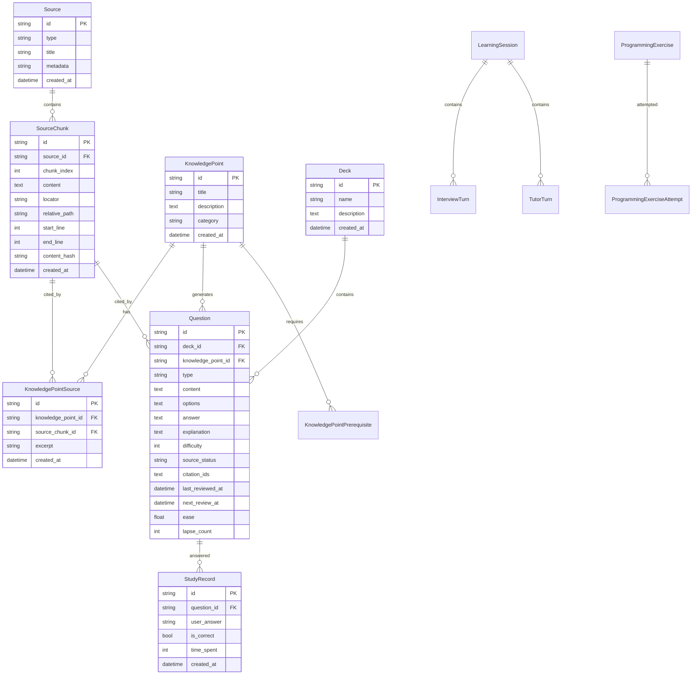

# 数据模型设计

## 当前答题保存边界（schema v24，2026-09-09）

本节对应当前实现；后文的早期 ER 图、模型片段和 JSON 导出草案不是完整的当前数据库定义。精确列定义见 [database_helper.dart](../../lib/data/database/database_helper.dart)，当前执行与验收结果见 [CURRENT_STATE.md](../CURRENT_STATE.md)。

- 一次答题通过 `QuizPersistenceService.saveAnswer`，将打卡、XP/心数、累计答对次数、题目复习时间、知识点掌握度和操作凭据放在同一个 SQLite 事务中。保存前重新读取题目，允许复习元数据更新，但拒绝题干、答案、来源状态等已改变的旧判题结果。
- 一次完成通过 `saveCompletion`，将完成/连续学习奖励、完美次数、恢复心数、题包学习记录、题包掌握度和凭据一并提交。题包记录仍使用 `<deckId>_record` 保存该题包最近一次结果；随机练习不创建题包记录。
- 页面为每次练习生成随机会话 ID，每题位置和完成动作各有固定操作 ID。失败重试保留已经得到的判题结果；同一个 ID 和相同输入会返回已提交的结果，输入不一致则拒绝。凭据可在数据库重开后重放，但本项没有新增跨进程恢复未完成答题页面的功能。
- 原有奖励数额、复习公式与掌握度权重保持不变。题目复习事件在事务成功后按原有隐私设置尽力记录；它们不属于核心保存成功条件，失败不会重新发放奖励。
- SQLite 拒绝最终 COMMIT 时，当前 sqflite 驱动可能仍占着事务。`DatabaseHelper.runInTransaction` 关闭该连接，使未提交内容回滚；下一次访问重新打开数据库，随后以操作凭据判断是否已经提交。

新增两张表：

| 表 | 字段与用途 |
| --- | --- |
| `quiz_save_operations` | `operation_id` 主键；`operation_kind` 为 answer/completion；`input_hash` 检查重试输入；`result_json` 仅保存统计、判题结果及复习时间；`created_at` 为毫秒时间。没有题干、用户答案或来源正文副本。 |
| `gamification_state` | `key` 主键和 `value_json`；保存累计答对/完美次数、月度打卡及勋章，另以 `legacy_preferences_imported` 标记一次性迁移完成。 |

原 SharedPreferences 中的 `total_correct`、`perfect_count`、`checkin_YYYY_M` 和 `medal_YYYY_M` 在首次使用时与迁移标记一并写入 SQLite，后续统计以数据库为准。旧偏好仅保留为迁移输入，学习历史删除会同时移除它们；数据库保留迁移完成标记，避免删除后再次导入旧值。其他设置和模型配置不属于这些统计。

当前备份是 SQLite 快照。`createBackup` 在生成快照前完成旧统计迁移，schema v24 的备份/恢复校验必须包含这两张表。较早的 v12–v23 SQLite 备份仍可升级，但它们没有包含当时的 SharedPreferences 统计，不能据此重建那些统计的历史快照。删除学习历史或学习内容时，也会清空新增统计和操作凭据。

## ER 图



---

## 核心表详解

### 1. Source (来源表)

存储导入的文档/项目元数据。

```dart
class Source {
  final String id;              // UUID
  final SourceType type;        // project/markdown/pdf
  final String title;           // 项目名或文档标题
  final Map<String, dynamic> metadata; // 扩展字段
  final DateTime createdAt;
}

enum SourceType {
  project,      // 代码项目
  markdown,     // Markdown 文档
  pdf,          // PDF 文档(未来支持)
  webpage,      // 网页抓取(未来支持)
}
```

**设计要点**:
- `metadata` 存储:
  - 项目: `{projectPath, language, fileCount}`
  - 文档: `{filePath, wordCount, author}`
- 一个 Source 可以包含多个文件(如整个代码项目)

---

### 2. SourceChunk (文档块表)

文档/代码的最小可引用单元。

```dart
class SourceChunk {
  final String id;              // source_id + chunk_index
  final String sourceId;        // 外键 → Source
  final int chunkIndex;         // 在 Source 内的序号
  final String content;         // 实际内容(纯文本)
  final String locator;         // 精确定位符
  final String? relativePath;   // 文件路径(项目导入用)
  final int? startLine;         // 起始行号
  final int? endLine;           // 结束行号
  final String contentHash;     // SHA256,用于检测更新
  final DateTime createdAt;
}
```

**Locator 格式示例**:
```
README.md:## 快速开始           (Markdown 标题定位)
lib/main.dart:15-42            (代码行号定位)
tutorial.pdf:第3章 异步编程      (PDF 章节定位)
```

**设计要点**:
- `locator` 是可读的人类友好定位符,显示在 UI 中
- `startLine/endLine` 用于代码高亮跳转
- `contentHash` 用于增量更新检测

---

### 3. KnowledgePoint (知识点表)

从文档中提取的知识点。

```dart
class KnowledgePoint {
  final String id;
  final String title;           // "Flutter 的 Widget 树机制"
  final String description;     // 详细描述
  final String? category;       // 分类(概念/API/最佳实践)
  final DateTime createdAt;
}
```

**示例**:
```json
{
  "id": "kp_001",
  "title": "StatefulWidget 的生命周期",
  "description": "StatefulWidget 通过 State 对象管理状态,生命周期包括 initState、build、dispose 等方法。",
  "category": "核心概念"
}
```

---

### 4. KnowledgePointSource (知识点引用表)

**关键表**: 实现知识点到源文档的可溯源链接。

```dart
class KnowledgePointSource {
  final String id;
  final String knowledgePointId;   // 外键 → KnowledgePoint
  final String sourceChunkId;      // 外键 → SourceChunk
  final String excerpt;            // 引用的具体文本片段
  final DateTime createdAt;
}
```

**示例**:
```json
{
  "id": "kps_001",
  "knowledgePointId": "kp_001",
  "sourceChunkId": "source_abc_chunk_5",
  "excerpt": "State 对象的生命周期从 initState() 开始..."
}
```

**设计要点**:
- 一个知识点可以有多个引用(从不同文档)
- `excerpt` 保存引用的具体文本,避免重新查询 chunk
- 用于生成 "查看来源" 功能

---

### 5. KnowledgePointPrerequisite (知识点依赖表)

```dart
class KnowledgePointPrerequisite {
  final String id;
  final String knowledgePointId;       // 当前知识点
  final String prerequisiteId;         // 前置知识点
  final String reason;                 // 为什么需要前置
  final DateTime createdAt;
}
```

**示例**:
```
"理解 StatefulWidget" 需要先理解 "Widget 基础"
原因: "StatefulWidget 是 Widget 的子类"
```

**用途**:
- 生成学习路径推荐
- 答题时提示 "可能需要先学习 X"

---

### 6. Question (题目表)

核心的练习题数据。

```dart
class Question {
  final String id;
  final String deckId;                 // 外键 → Deck
  final String? knowledgePointId;      // 外键 → KnowledgePoint
  final QuestionType type;             // 题型
  final String content;                // 题干
  final List<String> options;          // 选项(选择题用)
  final String answer;                 // 正确答案
  final String? explanation;           // 解析
  final int difficulty;                // 1-5
  final SourceStatus sourceStatus;     // verified/pending/no_source
  final List<String> citationIds;      // 引用的 chunk IDs
  
  // 间隔重复字段
  final DateTime? lastReviewedAt;
  final DateTime? nextReviewAt;
  final double ease;                   // 难度系数 0.5-3.0
  final int lapseCount;                // 累计错误次数
  
  // 匹配题专用
  final List<String>? matchLeft;
  final List<String>? matchRight;
}

enum QuestionType {
  singleChoice,    // 单选题
  multipleChoice,  // 多选题
  fillBlank,       // 填空题
  trueFalse,       // 判断题
  matching,        // 匹配题
  sorting,         // 排序题
}

enum SourceStatus {
  verified,        // 引用已核验
  pending,         // 待核验
  noSource,        // 无来源(用户手工创建)
}
```

**Citation 存储**:
```dart
citationIds: ["source_abc_chunk_3", "source_abc_chunk_7"]
```

**设计要点**:
- `sourceStatus` 区分 AI 生成(需核验) vs 用户创建
- `citationIds` JSON 数组,支持多个引用
- `ease` 初始值 1.0,每次正确 +0.1,错误 -0.2

---

### 7. StudyRecord (学习记录表)

```dart
class StudyRecord {
  final String id;
  final String questionId;          // 外键 → Question
  final String userAnswer;          // 用户的答案
  final bool isCorrect;             // 是否正确
  final int timeSpent;              // 答题用时(秒)
  final DateTime createdAt;
}
```

**用途**:
- 计算掌握度统计
- 生成学习曲线
- 识别常错题

---

### 8. Deck (卡组表)

```dart
class Deck {
  final String id;
  final String name;                // "Flutter 基础"
  final String? description;
  final DateTime createdAt;
}
```

**设计要点**:
- 一个 Deck 对应一个学习主题
- 导入项目时自动创建 Deck
- 用户可手动创建 Deck 并移动题目

---

## Agent 相关表

### 9. LearningSession (学习会话表)

```dart
class LearningSession {
  final String id;
  final LearningSessionType type;   // interview/tutor/knowledge_answer
  final String? knowledgePointId;   // 可选:关联的知识点
  final String? sourceId;           // 可选:关联的来源
  final Map<String, dynamic> metadata;
  final DateTime createdAt;
  final DateTime? completedAt;
}

enum LearningSessionType {
  interview,         // 项目代码面试
  tutor,             // 苏格拉底式辅导
  knowledgeAnswer,   // 知识问答
}
```

---

### 10. InterviewTurn / TutorTurn (对话轮次表)

```dart
class InterviewTurn {
  final String id;
  final String sessionId;           // 外键 → LearningSession
  final int turnIndex;              // 对话序号
  final String aiQuestion;          // AI 的问题
  final String? userAnswer;         // 用户的回答
  final String? aiEvaluation;       // AI 的评价
  final List<String> citedChunkIds; // 引用的 chunks
  final DateTime createdAt;
}

// TutorTurn 结构类似
class TutorTurn {
  final String id;
  final String sessionId;
  final int turnIndex;
  final String userQuestion;        // 用户的问题
  final String aiResponse;          // AI 的回答
  final List<String> citedChunkIds;
  final DateTime createdAt;
}
```

---

### 11. ProgrammingExercise (编程练习表)

```dart
class ProgrammingExercise {
  final String id;
  final String knowledgePointId;
  final String title;
  final String description;         // 题目描述
  final String starterCode;         // 起始代码
  final String expectedOutput;      // 预期输出
  final String? hint;
  final DateTime createdAt;
}
```

---

### 12. ProgrammingExerciseAttempt (编程练习尝试表)

```dart
class ProgrammingExerciseAttempt {
  final String id;
  final String exerciseId;
  final String userCode;            // 用户提交的代码
  final bool isPassed;              // 是否通过
  final String? feedback;           // AI 反馈
  final DateTime createdAt;
}
```

---

## 关键设计模式

### 1. Citation Chain (引用链)

```
用户点击题目的"查看来源"
  ↓
Question.citationIds: ["chunk_A", "chunk_B"]
  ↓
查询 SourceChunk 表
  ↓
显示:
  - chunk_A: lib/main.dart:15-42
  - chunk_B: README.md:## 快速开始
  ↓
用户点击 locator → 跳转到原文
```

### 2. Knowledge Graph (知识图谱)

```
KnowledgePoint "StatefulWidget"
  ↓ (has prerequisite)
KnowledgePoint "Widget 基础"
  ↓ (has source)
KnowledgePointSource
  ↓ (cites)
SourceChunk "Flutter 官方文档 chunk_5"
```

### 3. Mastery Tracking (掌握度追踪)

```sql
-- 查询某个知识点的掌握度
SELECT 
  kp.title,
  COUNT(sr.id) as total_attempts,
  SUM(CASE WHEN sr.is_correct THEN 1 ELSE 0 END) as correct_count,
  AVG(q.ease) as avg_ease
FROM knowledge_points kp
JOIN questions q ON q.knowledge_point_id = kp.id
LEFT JOIN study_records sr ON sr.question_id = q.id
WHERE kp.id = ?
GROUP BY kp.id
```

---

## 索引设计

### 高频查询索引

```sql
-- 1. 查询某个 Source 的所有 Chunks
CREATE INDEX idx_source_chunks_source_id 
ON source_chunks(source_id, chunk_index);

-- 2. 查询待复习的题目
CREATE INDEX idx_questions_next_review 
ON questions(next_review_at, deck_id);

-- 3. 查询某个知识点的题目
CREATE INDEX idx_questions_knowledge_point 
ON questions(knowledge_point_id);

-- 4. 查询某个题目的学习记录
CREATE INDEX idx_study_records_question 
ON study_records(question_id, created_at DESC);

-- 5. 查询某个会话的对话轮次
CREATE INDEX idx_interview_turns_session 
ON interview_turns(session_id, turn_index);
```

---

## 数据完整性约束

### 1. Citation 完整性

```dart
// 保存 Question 时校验 citationIds
for (final chunkId in question.citationIds) {
  final chunk = await sourceChunkRepo.getById(chunkId);
  if (chunk == null) {
    throw ValidationError('Invalid citation: $chunkId');
  }
}
```

### 2. Prerequisite 无环检测

```dart
// 添加前置依赖时检查是否形成环
bool wouldCreateCycle(String from, String to) {
  final visited = <String>{};
  return _dfs(to, from, visited);
}
```

---

## 数据迁移策略

### Version 1 → Version 2 示例

```dart
// migration_002_add_validation_fields.dart
Future<void> migrate(Database db) async {
  await db.execute('''
    ALTER TABLE questions 
    ADD COLUMN validation_confidence REAL DEFAULT 1.0
  ''');
  
  await db.execute('''
    ALTER TABLE questions 
    ADD COLUMN validation_issues TEXT
  ''');
}
```

---

## 数据备份格式

### JSON Export 结构

```json
{
  "version": "1.0.0",
  "exportedAt": "2026-07-26T10:00:00Z",
  "sources": [...],
  "sourceChunks": [...],
  "knowledgePoints": [...],
  "knowledgePointSources": [...],
  "questions": [...],
  "studyRecords": [...]
}
```

**用途**:
- 用户自行备份数据
- 跨设备迁移
- 未来云同步功能

---

## 性能优化

### 1. 分页查询

```dart
// 大量 chunks 分页加载
Future<List<SourceChunk>> getChunksBySource(
  String sourceId, {
  int offset = 0,
  int limit = 100,
}) async {
  return await db.query(
    'source_chunks',
    where: 'source_id = ?',
    whereArgs: [sourceId],
    orderBy: 'chunk_index ASC',
    limit: limit,
    offset: offset,
  );
}
```

### 2. 缓存策略

```dart
// Riverpod 自动缓存
final sourceChunksProvider = FutureProvider.family<List<SourceChunk>, String>(
  (ref, sourceId) async {
    return sourceChunkRepo.getBySourceId(sourceId);
  },
);
```

---

## 下一步阅读

- [AI Pipeline 设计](./AI_PIPELINE.md)
- [系统架构概览](./SYSTEM_OVERVIEW.md)
