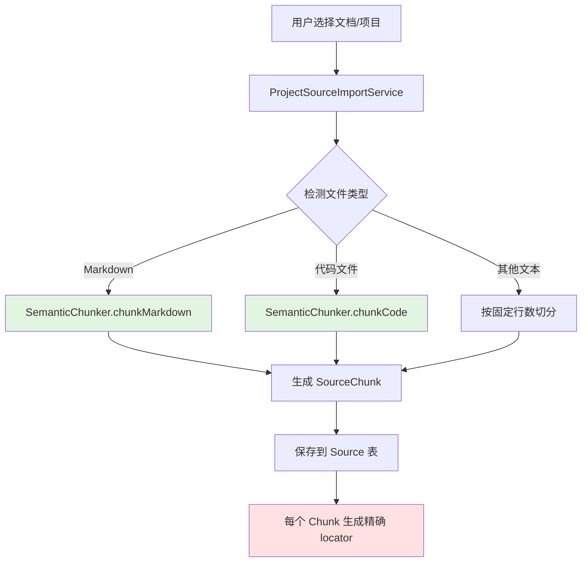
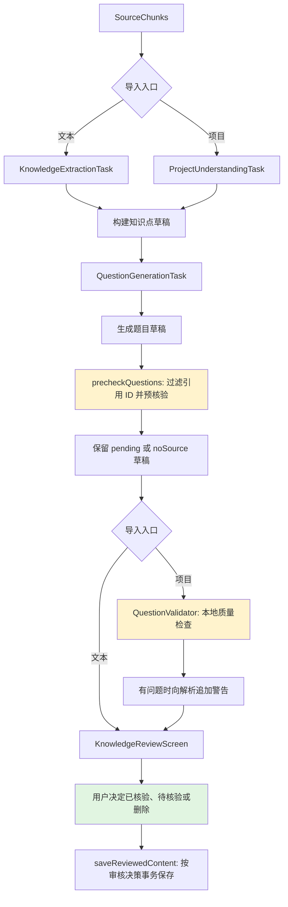
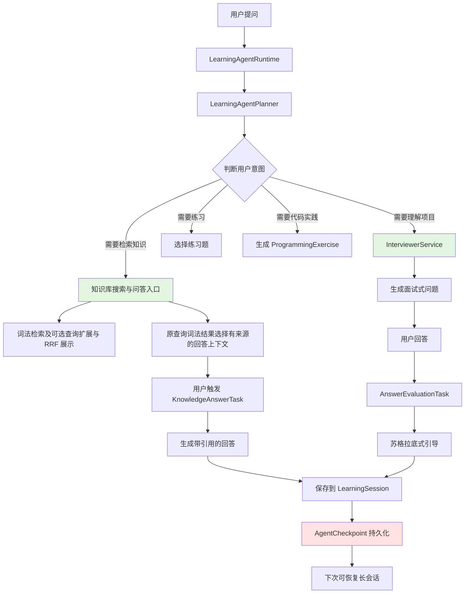
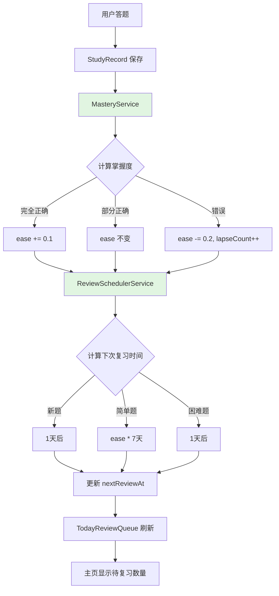

# 系统架构概览

> 2026-09-08：题目预核验、人工审核与知识搜索部分已按当前代码核对；当前开发指针见 [CURRENT_STATE.md](../CURRENT_STATE.md)。下文其他设计说明和性能估算不构成当日发布验收证据。

## 总体设计理念

**Anchor Learning (锚学)**是一个来源可溯源的 AI 学习代理系统,核心设计原则:

1. **可溯源性优先**: 每个知识点、每道题目都能追溯到源文档的具体位置
2. **来源核验与人工审核**: 模型引用预核验、项目导入的本地质量检查和人工审核共同提供依据；预核验分数不代表事实已被证明
3. **隐私优先**: 数据本地存储,可选云同步
4. **Agent 驱动**: 长会话学习代理,支持检查点恢复

---

## 四大核心流程

### 1. 文档导入流程 (Document Ingestion)



**关键设计**:
- **语义切分**: Markdown 按标题层级切分,保持段落完整性
- **Locator 生成**: 如 `README.md:## 架构设计` 或 `main.dart:45-67`
- **Content Hash**: 用于检测文档更新

**涉及文件**:
- `lib/services/ingestion/semantic_chunker.dart`
- `lib/services/ingestion/project_source_import_service.dart`
- `lib/data/models/source.dart`
- `lib/data/models/source_chunk.dart`

---

### 2. 题目生成流程 (Question Generation Pipeline)



**各层的实际职责**:

1. **Layer 1: Semantic Chunker**
   - 保持源文档结构完整性
   - 不切断段落/代码块中间

2. **Layer 2: Citation Verification**
   - `precheckQuestions` 过滤不存在的引用 ID；没有可用引用时保留 `noSource` 草稿。
   - 有可用引用时，`CitationVerificationTask` 调用模型判断给定片段是否支持答案和解析，返回候选可信、证据较弱或无来源等预核验结果，并过滤模型返回的引用 ID。
   - `precheckQuestions` 按结果调整引用和草稿状态：无法获得支持的引用会被移除，有保留引用的草稿仍为 `pending`；即使模型返回 `verified_candidate` 也不自动成为 `verified`。请求失败时按已知引用是否为空保留 `pending` 或 `noSource`。
   - 该预核验函数当前不把模型的 `reason` 写回题目解析；项目导入随后追加的是本地质量检查警告。

3. **Layer 3: 本地质量检查与人工审核**
   - 项目导入调用 `QuestionValidator.validateBatch`，按题型检查关键词、数字、答案、代码片段、匹配关系和顺序等局部规则；它不调用模型，不能证明任意事实正确。
   - `confidence` 根据发现的问题数量取 1.0、0.7、0.5 或 0.3，是规则检查摘要，不是事实正确率。项目导入只向未通过检查的题目解析追加警告；文本导入当前没有这一步。
   - 两个入口都进入 `KnowledgeReviewScreen`。`saveReviewedContent` 按审核决策保存，并再次过滤引用；没有有效引用的题目只能以 `noSource` 保存。

**涉及文件**:
- `lib/services/ai/tasks/knowledge_extraction_task.dart`
- `lib/services/ai/tasks/project_understanding_task.dart`
- `lib/services/ai/tasks/question_generation_task.dart`
- `lib/services/ai/tasks/citation_verification_task.dart`
- `lib/services/validation/question_validator.dart`
- `lib/services/ingestion/source_grounded_ingestion_service.dart`
- `lib/features/ingestion/ingestion_screen.dart`
- `lib/features/ingestion/project_import_screen.dart`
- `lib/features/ingestion/knowledge_review_screen.dart`

---

### 3. Agent 学习流程 (Learning Agent Pipeline)



**核心特性**:

- **本地检索**: `KnowledgeSearchService` 对词项覆盖、短语、标题、正文和元数据匹配计分，再结合来源可信度、题目核验状态排序；当前该实现不是 BM25 或 embedding 检索。
- **可选查询扩展**: `modelAssistedSearchEnabled` 默认关闭。启用后，`HybridKnowledgeSearchService` 对原查询及模型改写逐个执行同一个词法搜索，再用 RRF 融合；扩展提供方抛错时回退到原查询。`localSemantic` 是可选查询来源类型，不能据此认定已接入本地向量模型。
- **问答上下文**: 当前 `knowledgeAnswerGroundedContextProvider` 从 `knowledgeSearchResultsProvider` 的原查询词法结果选择片段。界面展示的融合结果与回答上下文是不同路径，不能假设问答已经使用融合排名。
- **检查点恢复**: 支持长会话中断后继续
- **多模式辅导**:
  - 知识问答: 基于知识库回答 + 引用链
  - 项目面试: 引导式提问帮助理解代码
  - 苏格拉底式: 不直接给答案,反问启发
  - 编程实践: 生成代码练习题 + 自动评测

**涉及文件**:
- `lib/services/agent/learning_agent_runtime.dart`
- `lib/services/agent/learning_agent_planner_service.dart`
- `lib/services/agent/hybrid_knowledge_search_service.dart`
- `lib/services/agent/knowledge_search_service.dart`
- `lib/services/agent/model_search_query_variant_provider.dart`
- `lib/services/agent/search_preferences.dart`
- `lib/core/providers/providers.dart`（`knowledgeHybridSearchReportProvider` 与 `knowledgeAnswerGroundedContextProvider`）
- `lib/services/agent/interviewer_service.dart`
- `lib/services/agent/learning_agent_checkpoint_store.dart`

---

### 4. 复习调度流程 (Review Scheduling)



**调度算法**:

基于 SuperMemo 的间隔重复算法变体:

```dart
double calculateInterval(Question q, bool isCorrect) {
  if (q.lastReviewedAt == null) return 1.0; // 新题1天后
  
  final daysSinceReview = DateTime.now()
    .difference(q.lastReviewedAt!)
    .inDays;
  
  if (isCorrect) {
    return daysSinceReview * q.ease; // ease越高,间隔越长
  } else {
    return 1.0; // 错误后重置为1天
  }
}
```

**掌握度追踪**:
- `ease`: 1.0 起步,每次正确+0.1,错误-0.2
- `lapseCount`: 累计错误次数,用于识别难点
- `lastReviewedAt`: 上次复习时间
- `nextReviewAt`: 下次应复习时间

**涉及文件**:
- `lib/services/scheduling/mastery_service.dart`
- `lib/services/scheduling/review_scheduler_service.dart`
- `lib/data/models/study_record.dart`

---

## 数据流向总览

```
用户上传文档
    ↓
[Semantic Chunker] 切分保留语义
    ↓
[Source + SourceChunk] 存储
    ↓
[AI Tasks] 提取知识点 → 生成题目
    ↓
[Citation Verification] 模型预核验，草稿保持 pending / noSource
    ↓
[项目导入：Question Validator] 本地规则检查并追加警告；文本导入跳过
    ↓
[KnowledgeReviewScreen] 人工审核
    ↓
[Question 题库] 保存
    ↓
[QuizScreen] 答题
    ↓
[MasteryService] 计算掌握度
    ↓
[ReviewScheduler] 调度下次复习
    ↓
[主页待复习队列] 显示
```

---

## 技术栈

### 前端
- **Flutter 3.x**: 跨平台 UI 框架
- **Riverpod**: 状态管理
- **Shared Preferences**: 本地配置存储
- **SQLite**: 本地数据库

### AI 层
- **OpenAI-compatible API**: 通过用户配置的 Base URL、模型和协议调用模型服务商
- **Prompt Engineering**: 结构化输出 + Few-shot examples
- **Citation Verification**: 通过 `chatCompletion` 获取并解析 JSON 预核验结果

### 后端(可选)
- **当前版本**: 学习内容与产品事件默认本地存储；主动 AI 任务会向用户选择的模型服务商发送所需片段
- **未来扩展**: Supabase / Firebase 同步

---

## 核心设计决策

### 为什么选择本地优先?
- ✅ 隐私保护: 学习内容默认保存在本地，AI 发送边界由用户主动配置和触发
- ✅ 离线可用: 除 AI 调用外都可离线
- ✅ 快速响应: 无网络延迟
- ⚠️ 代价: 需要用户自行备份

### 为什么不用向量数据库?
- 当前搜索从本地来源、片段、知识点和题目构建语料，在内存中进行词法评分，无需单独部署搜索服务。
- 可选模型查询扩展复用同一词法搜索并融合排名，当前这条路径不依赖向量数据库。
- 这里描述实现边界；搜索容量、耗时和相关性仍需对应数据集的测量，不能从服务名称推导性能或 embedding 能力。

### 为什么要 Citation Verification?
- **核心问题**: LLM 生成的"知识点"可能是幻觉
- **解决方案**: 强制 AI 引用具体 chunk,然后验证引用有效性
- **效果**: 大幅降低错误知识进入题库的概率

### 为什么新增 Question Validator?
- **作用**: 在项目导入中，以可重复的本地规则补充模型引用预核验，发现缺少原文支持的数字、答案、代码或关系等候选问题。
- **边界**: 模型预核验也会判断引用是否支持答案；本地质量检查是补充规则，不能取代模型判断或人工审核。
- **处理结果**: 项目导入追加问题提示和规则置信度，不更改审核状态。题目是否保存为 `verified` 由审核决策与有效引用共同决定。

---

## 扩展点设计

### 1. 自定义 Chunking 策略
```dart
abstract class ChunkStrategy {
  List<SourceChunk> chunk(String content, String locator);
}

class CustomPDFChunker implements ChunkStrategy {
  // 用户可实现自己的 PDF 切分逻辑
}
```

### 2. 自定义 AI Provider
```dart
abstract class AIService {
  Future<String> complete(String prompt);
}

class CustomAIService implements AIService {
  // 支持替换为本地模型/其他 API
}
```

### 3. 插件系统(规划中)
```dart
abstract class IngestionPlugin {
  bool canHandle(File file);
  List<SourceChunk> process(File file);
}

// 社区可贡献:
// - NotionImporter
// - ObsidianSyncPlugin
// - AnkiExportPlugin
```

---

## 性能考量

### 当前瓶颈
- **AI 调用延迟**: 生成 10 道题 ~30-60 秒
- **大文档导入**: 1000+ 行 Markdown ~5-10 秒

### 优化方向
- [ ] 批量 AI 调用(并发请求)
- [ ] 增量更新(只处理变更的 chunks)
- [ ] 本地缓存 AI 响应

### 可扩展性
- **SQLite 性能**: 支持到 100k+ questions 无压力
- **搜索性能**: 10k chunks 内存检索 <100ms
- **超过 10k chunks**: 考虑切换到 Meilisearch / Typesense

---

## 下一步阅读

- [数据模型详解](./DATA_MODEL.md)
- [AI Pipeline 设计](./AI_PIPELINE.md)
- [快速开始指南](../guides/QUICK_START.md)
