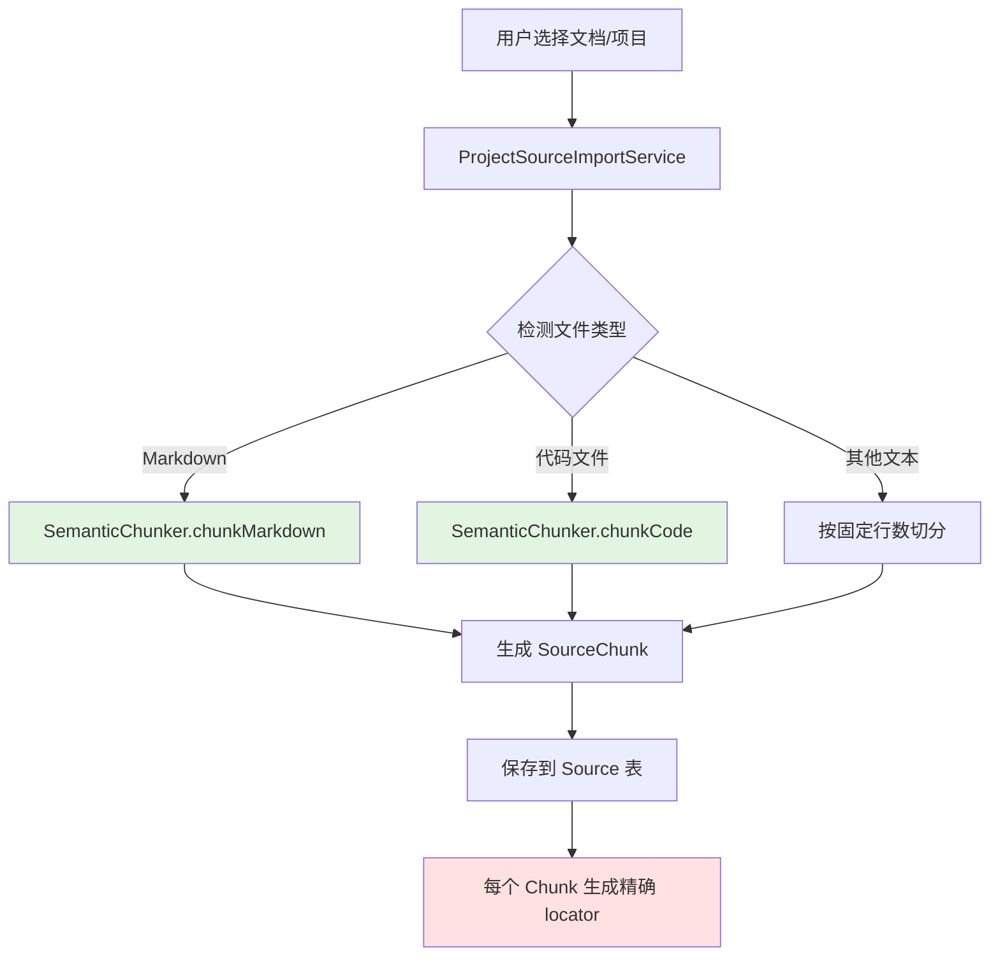
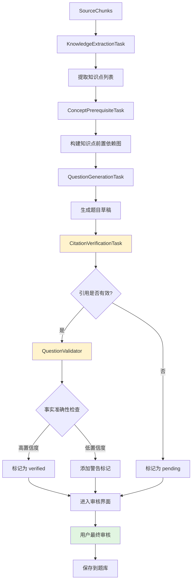
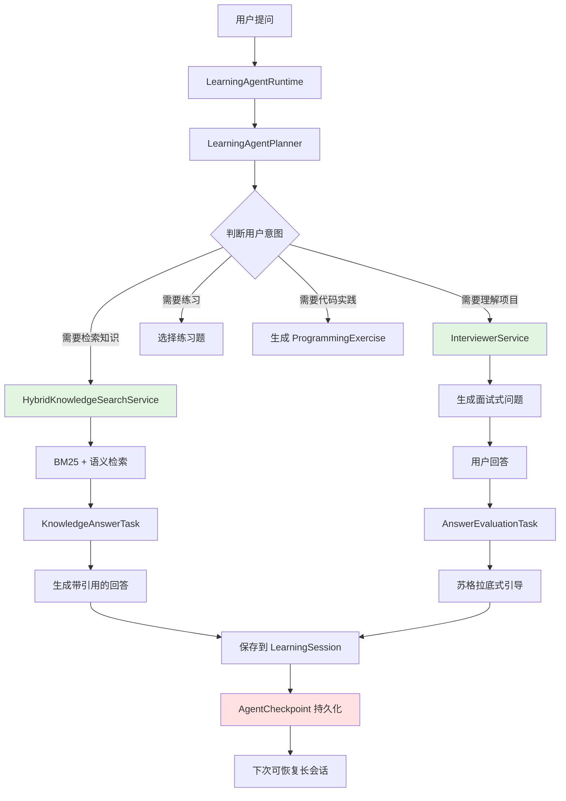
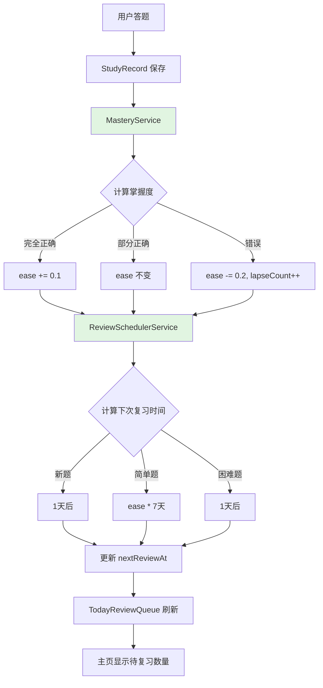

# 系统架构概览

## 总体设计理念

**Anchor Learning (锚学)**是一个来源可溯源的 AI 学习代理系统,核心设计原则:

1. **可溯源性优先**: 每个知识点、每道题目都能追溯到源文档的具体位置
2. **防幻觉机制**: 通过 Citation Verification 和 Question Validation 双重验证
3. **隐私优先**: 数据本地存储,可选云同步
4. **Agent 驱动**: 长会话学习代理,支持检查点恢复

---

## 四大核心流程

### 1. 文档导入流程 (Document Ingestion)



**关键设计**:
- **语义切分**: Markdown 按标题层级切分,保持段落完整性
- **Locator 生成**: 如 `README.md:## 架构设计` 或 `main.dart:45-67`
- **Content Hash**: 用于检测文档更新

**涉及文件**:
- `lib/services/ingestion/semantic_chunker.dart`
- `lib/services/ingestion/project_source_import_service.dart`
- `lib/data/models/source.dart`
- `lib/data/models/source_chunk.dart`

---

### 2. 题目生成流程 (Question Generation Pipeline)



**防幻觉三层防线**:

1. **Layer 1: Semantic Chunker**
   - 保持源文档结构完整性
   - 不切断段落/代码块中间

2. **Layer 2: Citation Verification**
   - AI 必须引用具体 chunk ID
   - 验证引用的 chunk 是否真实存在
   - 检查引用内容是否支持结论

3. **Layer 3: Question Validator** ⭐ 新增
   - 二次核验生成的答案是否与源文档一致
   - 检查 explanation 是否真的基于 citedChunks
   - 逻辑一致性检查(选项设计、题干表述)

**涉及文件**:
- `lib/services/ai/tasks/knowledge_extraction_task.dart`
- `lib/services/ai/tasks/question_generation_task.dart`
- `lib/services/ai/tasks/citation_verification_task.dart`
- `lib/services/validation/question_validator.dart` ⭐ 新增
- `lib/services/ingestion/source_grounded_ingestion_service.dart`

---

### 3. Agent 学习流程 (Learning Agent Pipeline)



**核心特性**:

- **混合检索**: BM25(关键词) + Embedding(语义)
- **检查点恢复**: 支持长会话中断后继续
- **多模式辅导**:
  - 知识问答: 基于知识库回答 + 引用链
  - 项目面试: 引导式提问帮助理解代码
  - 苏格拉底式: 不直接给答案,反问启发
  - 编程实践: 生成代码练习题 + 自动评测

**涉及文件**:
- `lib/services/agent/learning_agent_runtime.dart`
- `lib/services/agent/learning_agent_planner_service.dart`
- `lib/services/agent/hybrid_knowledge_search_service.dart`
- `lib/services/agent/interviewer_service.dart`
- `lib/services/agent/learning_agent_checkpoint_store.dart`

---

### 4. 复习调度流程 (Review Scheduling)



**调度算法**:

基于 SuperMemo 的间隔重复算法变体:

```dart
double calculateInterval(Question q, bool isCorrect) {
  if (q.lastReviewedAt == null) return 1.0; // 新题1天后
  
  final daysSinceReview = DateTime.now()
    .difference(q.lastReviewedAt!)
    .inDays;
  
  if (isCorrect) {
    return daysSinceReview * q.ease; // ease越高,间隔越长
  } else {
    return 1.0; // 错误后重置为1天
  }
}
```

**掌握度追踪**:
- `ease`: 1.0 起步,每次正确+0.1,错误-0.2
- `lapseCount`: 累计错误次数,用于识别难点
- `lastReviewedAt`: 上次复习时间
- `nextReviewAt`: 下次应复习时间

**涉及文件**:
- `lib/services/scheduling/mastery_service.dart`
- `lib/services/scheduling/review_scheduler_service.dart`
- `lib/data/models/study_record.dart`

---

## 数据流向总览

```
用户上传文档
    ↓
[Semantic Chunker] 切分保留语义
    ↓
[Source + SourceChunk] 存储
    ↓
[AI Tasks] 提取知识点 → 生成题目
    ↓
[Citation Verification] 验证引用
    ↓
[Question Validator] 验证事实 ⭐
    ↓
[KnowledgeReviewScreen] 人工审核
    ↓
[Question 题库] 保存
    ↓
[QuizScreen] 答题
    ↓
[MasteryService] 计算掌握度
    ↓
[ReviewScheduler] 调度下次复习
    ↓
[主页待复习队列] 显示
```

---

## 技术栈

### 前端
- **Flutter 3.x**: 跨平台 UI 框架
- **Riverpod**: 状态管理
- **Shared Preferences**: 本地配置存储
- **SQLite**: 本地数据库

### AI 层
- **OpenAI-compatible API**: 通过用户配置的 Base URL、模型和协议调用模型服务商
- **Prompt Engineering**: 结构化输出 + Few-shot examples
- **Function Calling**: 用于 Citation Verification

### 后端(可选)
- **当前版本**: 学习内容与产品事件默认本地存储；主动 AI 任务会向用户选择的模型服务商发送所需片段
- **未来扩展**: Supabase / Firebase 同步

---

## 核心设计决策

### 为什么选择本地优先?
- ✅ 隐私保护: 学习内容默认保存在本地，AI 发送边界由用户主动配置和触发
- ✅ 离线可用: 除 AI 调用外都可离线
- ✅ 快速响应: 无网络延迟
- ⚠️ 代价: 需要用户自行备份

### 为什么不用向量数据库?
- 当前规模(<10k chunks)下 SQLite + 内存搜索足够快
- BM25(关键词) + Embedding(语义) 混合检索效果好
- 降低部署复杂度,用户无需额外服务

### 为什么要 Citation Verification?
- **核心问题**: LLM 生成的"知识点"可能是幻觉
- **解决方案**: 强制 AI 引用具体 chunk,然后验证引用有效性
- **效果**: 大幅降低错误知识进入题库的概率

### 为什么新增 Question Validator?
- **发现的问题**: Citation Verification 只验证"有引用",不验证"引用正确"
- **案例**: AI 可能引用了 chunk A,但生成的答案基于 chunk B 的内容
- **解决方案**: 二次核验生成的答案/选项是否与 cited chunks 一致
- **置信度评分**: 0.0-1.0,低于阈值的题目会标记警告

---

## 扩展点设计

### 1. 自定义 Chunking 策略
```dart
abstract class ChunkStrategy {
  List<SourceChunk> chunk(String content, String locator);
}

class CustomPDFChunker implements ChunkStrategy {
  // 用户可实现自己的 PDF 切分逻辑
}
```

### 2. 自定义 AI Provider
```dart
abstract class AIService {
  Future<String> complete(String prompt);
}

class CustomAIService implements AIService {
  // 支持替换为本地模型/其他 API
}
```

### 3. 插件系统(规划中)
```dart
abstract class IngestionPlugin {
  bool canHandle(File file);
  List<SourceChunk> process(File file);
}

// 社区可贡献:
// - NotionImporter
// - ObsidianSyncPlugin
// - AnkiExportPlugin
```

---

## 性能考量

### 当前瓶颈
- **AI 调用延迟**: 生成 10 道题 ~30-60 秒
- **大文档导入**: 1000+ 行 Markdown ~5-10 秒

### 优化方向
- [ ] 批量 AI 调用(并发请求)
- [ ] 增量更新(只处理变更的 chunks)
- [ ] 本地缓存 AI 响应

### 可扩展性
- **SQLite 性能**: 支持到 100k+ questions 无压力
- **搜索性能**: 10k chunks 内存检索 <100ms
- **超过 10k chunks**: 考虑切换到 Meilisearch / Typesense

---

## 下一步阅读

- [数据模型详解](./DATA_MODEL.md)
- [AI Pipeline 设计](./AI_PIPELINE.md)
- [快速开始指南](../guides/QUICK_START.md)
